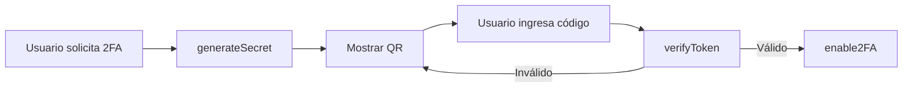
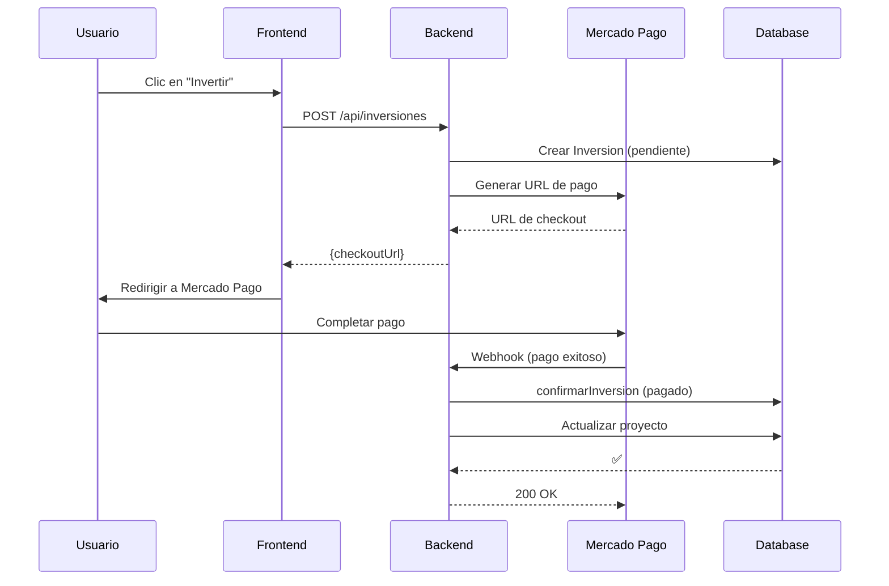
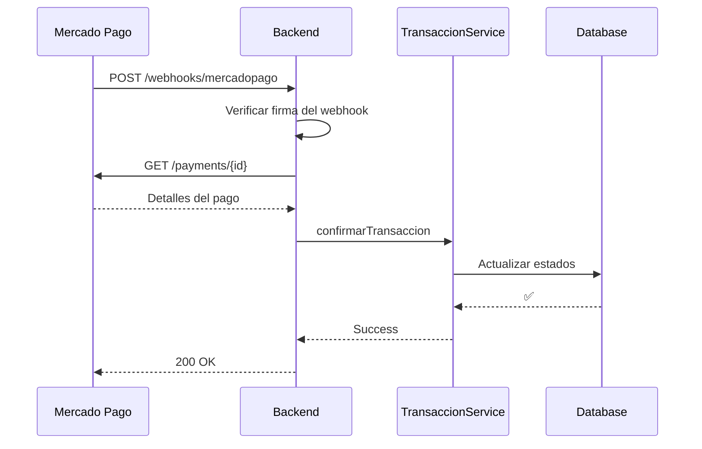

# 🎨 Guía Completa de Integración Frontend
## Nectárea API - Plataforma de Crowdfunding

<div align="center">

**Documentación Técnica para Desarrolladores Frontend**

*Versión 1.0 | Octubre 2025*

</div>

---

## 📋 Tabla de Contenidos

1. [Introducción](#introducción)
2. [Requisitos Previos](#requisitos-previos)
3. [Configuración del Backend](#configuración-del-backend)
4. [Configuración del Frontend](#configuración-del-frontend)
5. [Modelos de Base de Datos](#modelos-de-base-de-datos)
6. [Reglas de Negocio Críticas](#reglas-de-negocio-críticas)
7. [Servicios del Backend](#servicios-del-backend)

---

## 🚀 Introducción

### ¿Qué es Nectárea?

Nectárea es una plataforma de **crowdfunding** (similar a Kickstarter) que permite:

- ✅ **Inversiones directas** en proyectos
- ✅ **Pujas** en subastas de lotes
- ✅ **Suscripciones mensuales** a proyectos
- ✅ **Pagos integrados** con Mercado Pago

### Arquitectura del Sistema

```
┌─────────────────┐      HTTP/REST      ┌─────────────────┐
│                 │ ◄──────────────────► │                 │
│   Frontend      │                      │   Backend API   │
│  (React/Vue)    │                      │   (Node.js)     │
│                 │                      │                 │
└─────────────────┘                      └────────┬────────┘
                                                  │
                                                  │
                                         ┌────────▼────────┐
                                         │   PostgreSQL    │
                                         │   Database      │
                                         └─────────────────┘
```

---

## 📚 Requisitos Previos

### Conocimientos Necesarios

| ✅ **Requeridos** | ❌ **NO Necesarios** |
|-------------------|----------------------|
| JavaScript básico | Node.js/Express internamente |
| HTTP (GET, POST, PUT, DELETE) | PostgreSQL a profundidad |
| JSON | Webhooks internamente |
| React/Vue/Angular | Arquitectura de backend |

### Herramientas Requeridas

| Herramienta | Versión | Propósito |
|-------------|---------|-----------|
| **Node.js** | v18+ | Runtime del backend |
| **PostgreSQL** | v14+ | Base de datos |
| **Git** | Latest | Control de versiones |
| **Postman/Thunder Client** | Latest | Pruebas de API |

---

## 🔧 Configuración del Backend

### Paso 1: Clonar el Repositorio

```bash
# Clona el proyecto
git clone https://github.com/SebastianASU2005/Nectarea_BD.git
cd Nectarea_BD

# Instala las dependencias
npm install
```

⏳ *Este proceso tomará unos minutos*

---

### Paso 2: Instalar PostgreSQL

<details>
<summary><b>🪟 Windows</b></summary>

1. Descarga PostgreSQL desde: https://www.postgresql.org/download/windows/
2. Ejecuta el instalador
3. Durante la instalación:
   - Puerto: **5432** (por defecto)
   - Anota la contraseña que elijas
4. Completa la instalación

</details>

<details>
<summary><b>🍎 macOS</b></summary>

```bash
# Instalar con Homebrew
brew install postgresql@14

# Iniciar el servicio
brew services start postgresql@14
```

</details>

<details>
<summary><b>🐧 Linux (Ubuntu/Debian)</b></summary>

```bash
# Actualizar repositorios
sudo apt update

# Instalar PostgreSQL
sudo apt install postgresql postgresql-contrib

# Iniciar el servicio
sudo systemctl start postgresql
```

</details>

---

### Paso 3: Crear la Base de Datos

```bash
# Conectarse a PostgreSQL
psql -U postgres
```

```sql
-- Dentro de la consola de PostgreSQL

-- Crear la base de datos
CREATE DATABASE nectarea_dev;

-- Crear el usuario
CREATE USER nectarea_user WITH PASSWORD 'dev_password_123';

-- Otorgar permisos
GRANT ALL PRIVILEGES ON DATABASE nectarea_dev TO nectarea_user;

-- Salir
\q
```

> ⚠️ **Importante:** Guarda estos datos, los necesitarás en el siguiente paso.

---

### Paso 4: Configurar Variables de Entorno

Crea un archivo `.env` en la raíz del proyecto:

```bash
touch .env
```

Copia y pega la siguiente configuración:

```env
# ═══════════════════════════════════════════════════
#  CONFIGURACIÓN DE ENTORNO - DESARROLLO
# ═══════════════════════════════════════════════════

# --- Entorno ---
NODE_ENV=development

# --- Servidor ---
PORT=3000
HOST_URL=http://localhost:3000
FRONTEND_URL=http://localhost:5173

# --- Base de Datos ---
DB_HOST=localhost
DB_PORT=5432
DB_NAME=nectarea_dev
DB_USER=nectarea_user
DB_PASSWORD=dev_password_123
DB_DIALECT=postgres

# --- JWT (Autenticación) ---
JWT_SECRET=mi_secreto_super_seguro_de_desarrollo_cambiar_en_produccion
JWT_EXPIRES_IN=7d

# --- Mercado Pago (Dejar vacío por ahora) ---
MP_ACCESS_TOKEN=
MP_WEBHOOK_SECRET=
MP_CURRENCY_ID=ARS

# --- Email (Opcional en desarrollo) ---
EMAIL_HOST=smtp.gmail.com
EMAIL_PORT=587
EMAIL_SECURE=false
EMAIL_USER=
EMAIL_PASSWORD=
EMAIL_FROM=noreply@nectarea.com
```

> 🔐 **Seguridad:** Asegúrate de usar los mismos valores que configuraste en el Paso 3.

---

### Paso 5: Inicializar la Base de Datos

```bash
npm run migrate
```

**Salida esperada:**

```
✓ Ejecutando migraciones...
✓ Tabla 'usuarios' creada
✓ Tabla 'proyectos' creada
✓ Tabla 'transacciones' creada
...
✅ Base de datos sincronizada correctamente
```

---

### Paso 6: Iniciar el Backend

```bash
npm run dev
```

**Salida esperada:**

```
✅ Conectado a la base de datos PostgreSQL
✅ Servidor corriendo en http://localhost:3000
⚠️  Mercado Pago SDK no configurado (esperado en desarrollo)
```

---

### Paso 7: Verificar que Funciona

Abre tu navegador y visita:

```
http://localhost:3000/api/health
```

**Respuesta esperada:**

```json
{
  "status": "ok",
  "timestamp": "2025-10-15T10:30:00.000Z"
}
```

✅ **¡Perfecto! El backend está funcionando correctamente.**

---

## ⚙️ Configuración del Frontend

### Paso 1: Crear el Proyecto Frontend

<details>
<summary><b>⚛️ React (con Vite)</b></summary>

```bash
npm create vite@latest nectarea-frontend -- --template react
cd nectarea-frontend
npm install
```

</details>

<details>
<summary><b>💚 Vue (con Vite)</b></summary>

```bash
npm create vite@latest nectarea-frontend -- --template vue
cd nectarea-frontend
npm install
```

</details>

---

### Paso 2: Instalar Axios

```bash
npm install axios
```

---

### Paso 3: Crear el Servicio de API

Crea el archivo: `src/services/api.js`

```javascript
import axios from "axios";

// ═══════════════════════════════════════════════════
//  CONFIGURACIÓN BASE DE LA API
// ═══════════════════════════════════════════════════

const API_URL = import.meta.env.VITE_API_URL || "http://localhost:3000/api";

const apiClient = axios.create({
  baseURL: API_URL,
  timeout: 15000,
  headers: {
    "Content-Type": "application/json",
  },
});

// ═══════════════════════════════════════════════════
//  INTERCEPTOR DE REQUEST
//  Agrega el token automáticamente
// ═══════════════════════════════════════════════════

apiClient.interceptors.request.use(
  (config) => {
    const token = localStorage.getItem("token");
    
    if (token) {
      config.headers.Authorization = `Bearer ${token}`;
    }

    console.log(`📤 ${config.method.toUpperCase()} ${config.url}`);
    return config;
  },
  (error) => {
    console.error("❌ Error en request:", error);
    return Promise.reject(error);
  }
);

// ═══════════════════════════════════════════════════
//  INTERCEPTOR DE RESPONSE
//  Maneja errores automáticamente
// ═══════════════════════════════════════════════════

apiClient.interceptors.response.use(
  (response) => {
    console.log(`✅ Respuesta recibida de ${response.config.url}`);
    return response;
  },
  (error) => {
    if (error.response) {
      const { status } = error.response;

      // Token expirado o inválido
      if (status === 401) {
        console.error("🚫 Token inválido o expirado");
        localStorage.removeItem("token");
        localStorage.removeItem("user");
        window.location.href = "/login";
      }

      // Sin permisos
      if (status === 403) {
        console.error("🚫 No tienes permisos para esta acción");
      }
    } else if (error.request) {
      console.error("❌ No se pudo conectar con el servidor");
    }

    return Promise.reject(error);
  }
);

export default apiClient;
```

---

### Paso 4: Configurar Variables de Entorno

Crea el archivo `.env` en la raíz de tu proyecto frontend:

```env
VITE_API_URL=http://localhost:3000/api
```

---

### Paso 5: Crear un Servicio de Prueba

Crea el archivo: `src/services/authService.js`

```javascript
import apiClient from "./api";

// ═══════════════════════════════════════════════════
//  SERVICIO DE AUTENTICACIÓN
// ═══════════════════════════════════════════════════

/**
 * Función de prueba de conexión
 */
export const testConnection = async () => {
  try {
    const response = await apiClient.get("/health");
    console.log("✅ Conexión exitosa:", response.data);
    return response.data;
  } catch (error) {
    console.error("❌ Error de conexión:", error);
    throw error;
  }
};
```

---

### Paso 6: Probar la Conexión

Modifica tu `App.jsx` (o `App.vue`):

```jsx
import { useEffect } from "react";
import { testConnection } from "./services/authService";

function App() {
  useEffect(() => {
    testConnection();
  }, []);

  return (
    <div className="App">
      <h1>🍯 Nectárea Frontend</h1>
      <p>Revisa la consola del navegador (F12)</p>
    </div>
  );
}

export default App;
```

---

### Paso 7: Iniciar el Frontend

```bash
npm run dev
```

Abre tu navegador en `http://localhost:5173` y presiona **F12** para ver la consola.

**Salida esperada en la consola:**

```
📤 GET /health
✅ Respuesta recibida de /health
✅ Conexión exitosa: { status: 'ok', timestamp: '...' }
```

✅ **¡Excelente! Tu frontend se comunica con el backend.**

---

## 📊 Modelos de Base de Datos

### ¿Qué es un Modelo?

Un **Modelo** es la representación en código de una **tabla** en la base de datos, definiendo sus columnas, tipos de datos y relaciones.

### Resumen de Modelos

| Modelo | Tabla | Propósito |
|--------|-------|-----------|
| `Usuario` | `usuario` | Gestión de cuentas y autenticación |
| `Proyecto` | `proyecto` | Proyectos de inversión |
| `Transaccion` | `transaccion` | Registro de flujos de dinero |
| `SuscripcionProyecto` | `suscripcion_proyecto` | Vínculo usuario-proyecto |
| `Puja` | `puja` | Ofertas en subastas |
| `Lote` | `lote` | Activos subastados |
| `Pago` | `pago` | Cuotas mensuales |
| `PagoMercado` | `pagos_mercado` | Pagos de pasarela |

---

### 1. Usuario (`usuario`)

**Propósito:** Gestión de cuentas de usuario y autenticación.

| Atributo | Tipo | Descripción |
|----------|------|-------------|
| `id` | `INTEGER` | 🔑 Clave primaria |
| `nombre` | `STRING(100)` | Nombre del usuario |
| `apellido` | `STRING(100)` | Apellido del usuario |
| `email` | `STRING(255)` | ✉️ Email (único) |
| `dni` | `STRING(20)` | 🆔 DNI (único) |
| `nombre_usuario` | `STRING(50)` | 👤 Username (único) |
| `contraseña_hash` | `STRING(255)` | 🔒 Contraseña hasheada |
| `rol` | `ENUM` | 👑 `"admin"` o `"cliente"` |
| `activo` | `BOOLEAN` | ✅ Cuenta activa |
| `confirmado_email` | `BOOLEAN` | ✉️ Email verificado |
| `is_2fa_enabled` | `BOOLEAN` | 🔐 2FA activo |
| `twofa_secret` | `STRING(255)` | 🔑 Clave 2FA |

---

### 2. Proyecto (`proyecto`)

**Propósito:** Almacena los detalles de cada oportunidad de inversión.

| Atributo | Tipo | Descripción |
|----------|------|-------------|
| `id` | `INTEGER` | 🔑 Clave primaria |
| `nombre_proyecto` | `STRING(255)` | 📋 Nombre del proyecto |
| `descripcion` | `TEXT` | 📝 Descripción detallada |
| `tipo_inversion` | `ENUM` | 💰 `"directo"` o `"mensual"` |
| `monto_inversion` | `DECIMAL(18,2)` | 💵 Monto objetivo |
| `estado_proyecto` | `ENUM` | 🚦 Estado actual |
| `suscripciones_actuales` | `INTEGER` | 👥 Contador de inversores |
| `fecha_inicio` | `DATEONLY` | 📅 Fecha de inicio |
| `fecha_cierre` | `DATEONLY` | 📅 Fecha de cierre |
| `pack_de_lotes` | `BOOLEAN` | 📦 Gestiona subastas |

**Estados Posibles:**
- 🟡 `"En Espera"` - Esperando fondeo
- 🟢 `"En proceso"` - Fondeado y activo
- 🔵 `"Finalizado"` - Completado

---

### 3. Transacción (`transaccion`)

**Propósito:** Registro central de todos los flujos de dinero.

| Atributo | Tipo | Descripción |
|----------|------|-------------|
| `id` | `INTEGER` | 🔑 Clave primaria |
| `id_usuario` | `INTEGER` | 👤 Usuario que transacciona |
| `monto` | `DECIMAL(15,2)` | 💰 Monto de la transacción |
| `tipo_transaccion` | `STRING(50)` | 📊 Tipo de operación |
| `estado_transaccion` | `ENUM` | 🚦 Estado del pago |

**Estados Posibles:**
- 🟡 `"pendiente"` - Esperando confirmación
- 🟢 `"pagado"` - Pago exitoso
- 🔴 `"fallido"` - Pago rechazado
- 🔵 `"reembolsado"` - Devuelto al usuario

---

### 4. Puja (`puja`)

**Propósito:** Registro de ofertas en subastas de lotes.

| Atributo | Tipo | Descripción |
|----------|------|-------------|
| `id` | `INTEGER` | 🔑 Clave primaria |
| `id_lote` | `INTEGER` | 📦 Lote subastado |
| `id_usuario` | `INTEGER` | 👤 Usuario que puja |
| `monto_puja` | `DECIMAL(15,2)` | 💰 Monto ofertado |
| `estado_puja` | `ENUM` | 🚦 Estado de la puja |
| `fecha_vencimiento_pago` | `DATE` | ⏰ Límite de pago |

**Estados Posibles:**
- 🟢 `"activa"` - Puja en curso
- 🟡 `"ganadora_pendiente"` - Ganó, esperando pago
- 🔴 `"perdedora"` - No ganó la subasta
- ⚫ `"ganadora_incumplimiento"` - No pagó a tiempo

---

## 🎯 Reglas de Negocio Críticas

### ¿Qué son las Reglas de Negocio?

Las **reglas de negocio** son restricciones y validaciones que el backend implementa para mantener la integridad de los datos. Si no las respetas en el frontend, tus requests fallarán.

### ¿Por qué es crítico conocerlas?

- ✅ Evitarás errores 400, 409 y 500
- ✅ Entenderás por qué ciertas acciones requieren verificaciones previas
- ✅ Sabrás qué datos validar antes de enviarlos
- ✅ Implementarás la UI correctamente

---

## 🔧 Servicios del Backend

### 🔐 1. Servicio de Seguridad (authService)

**Propósito:** Manejo seguro de contraseñas y autenticación.

**Librería:** `bcryptjs`

#### Métodos Principales

| Método | Propósito | Regla Crítica |
|--------|-----------|---------------|
| `hashPassword` | Hashea contraseñas | 🚫 **NUNCA** almacenar contraseñas en texto plano |
| `comparePassword` | Verifica contraseñas | Usado en login para validar credenciales |

**Ejemplo de uso:**

```javascript
// Registro
const hashedPassword = await authService.hashPassword("miPassword123");
// Guardar hashedPassword en la DB

// Login
const esValido = await authService.comparePassword(
  "miPassword123",
  usuario.contraseña_hash
);
```

> ⚠️ **Importante:** El factor de salt de 10 es el estándar de seguridad.

---

### 🔐 2. Servicio de Autenticación 2FA (auth2faService)

**Propósito:** Gestión de autenticación de dos factores (TOTP).

**Librería:** `speakeasy`

#### Métodos Principales

| Método | Propósito | Regla Crítica |
|--------|-----------|---------------|
| `generateSecret` | Genera código QR | Incluye email del usuario |
| `verifyToken` | Valida código 2FA | Ventana de ±30 segundos |
| `enable2FA` | Activa 2FA | Solo después de validar token |
| `disable2FA` | Desactiva 2FA | Requiere contraseña + código 2FA |

#### Flujo de Activación 2FA



---

### 📄 3. Servicio de Contratos (contratoService)

**Propósito:** Gestión e integridad criptográfica de documentos legales.

#### Métodos Principales

| Método | Propósito | Regla Crítica |
|--------|-----------|---------------|
| `create` | Registra contrato | Requiere `hash_archivo_original` |
| `findAndVerifyById` | Verifica integridad | Compara hash almacenado vs actual |
| `registerSignature` | Vincula firma | Asocia inversión con contrato firmado |

#### Verificación de Integridad

```javascript
// El sistema compara hashes
const hashActual = await generateFileHash(contrato.url_archivo);

if (hashActual !== contrato.hash_archivo_original) {
  // ⚠️ ¡ARCHIVO MODIFICADO!
  contrato.integrity_compromised = true;
}
```

> 🔒 **Seguridad:** Si el hash no coincide, el archivo fue alterado.

---

### 💰 4. Servicio de Cuotas Mensuales (cuotaMensualService)

**Propósito:** Cálculo del monto mensual para suscripciones.

#### Fórmula de Cálculo

```
1. Costo Base = valor_cemento_unidades × valor_cemento
2. Total del Plan = Costo Base × (porcentaje_plan / 100)
3. Valor Mensual = Total del Plan / total_cuotas
4. Carga Admin = Costo Base × (porcentaje_admin / 100)
5. IVA = Carga Admin × (porcentaje_iva / 100)
6. VALOR FINAL = Valor Mensual + Carga Admin + IVA
```

> 💡 **Nota:** Todos los valores se redondean a 2 decimales.

---

### 📧 5. Servicio de Email (emailService)

**Propósito:** Envío de correos transaccionales.

**Librería:** `nodemailer`

#### Métodos Principales

| Método | Cuándo se Envía | Propósito |
|--------|----------------|-----------|
| `sendConfirmationEmail` | Al registrarse | Activar cuenta |
| `notificarGanadorPuja` | Al ganar subasta | Informar victoria y plazo |
| `notificarImpago` | Después de 90 días | Informar pérdida del lote |

---

### 🖼️ 6. Servicio de Imágenes (imagenService)

**Propósito:** Gestión de contenido visual.

**Concepto Clave:** Borrado suave (soft delete)

```javascript
// No elimina físicamente, solo marca como inactivo
await imagenService.softDelete(imagenId);

// Consulta solo imágenes activas
const imagenes = await imagenService.findByProjectIdActivo(proyectoId);
```

> ✅ **Beneficio:** Mantiene historial y permite auditoría.

---

### 💼 7. Servicio de Inversiones (inversionService)

**Propósito:** Gestión de inversiones en proyectos.

#### Flujo de Inversión



---

### 🔑 8. Servicio de JWT (jwtService)

**Propósito:** Creación y verificación de tokens de sesión.

**Librería:** `jsonwebtoken`

#### Tipos de Tokens

| Tipo | Duración | Contenido | Uso |
|------|----------|-----------|-----|
| **Sesión** | 1 hora | `id`, `nombre_usuario`, `rol` | Operaciones diarias |
| **2FA** | 5 minutos | Solo `id` | Verificación de segundo factor |

**Ejemplo de payload:**

```json
{
  "id": 42,
  "nombre_usuario": "admin_pablo",
  "rol": "administrador",
  "iat": 1634283600,
  "exp": 1634287200
}
```

> 🔐 **Crítico:** La variable `JWT_SECRET` debe ser larga y compleja en producción.

---

### 🏆 9. Servicio de Lotes y Subastas (loteService)

**Propósito:** Gestión completa del ciclo de vida de las subastas.

#### Métodos Críticos

| Método | Propósito | Lógica de Negocio |
|--------|-----------|-------------------|
| `endAuction` | Finaliza subasta | Asigna ganador, plazo de 90 días |
| `procesarImpagoLote` | Maneja impagos | Después de 90 días, reasigna al siguiente |
| `asignarSiguientePuja` | Reasignación | Ofrece al 2º postor |
| `prepararLoteParaReingreso` | Limpia lote | Después de 3 intentos fallidos |

#### Flujo de Subasta

```
1. Subasta Activa
   ↓
2. endAuction → Ganador P1 (90 días para pagar)
   ↓
3a. ✅ Paga → procesarPujaGanadora
   ↓
   Aplica excedente, libera tokens
   
3b. ❌ No paga → procesarImpagoLote
   ↓
   Reasigna a P2 (90 días)
   ↓
   Si P2 no paga → Reasigna a P3
   ↓
   Si P3 no paga → prepararLoteParaReingreso
```

---

### 💬 10. Servicio de Mensajes (mensajeService)

**Propósito:** Sistema de mensajería interno.

**Regla Crítica:** Usuario del Sistema (ID = 1)

```javascript
// Mensaje automático del sistema
await mensajeService.enviarMensajeSistema(
  userId,
  "¡Felicidades! Has ganado el Lote #10."
);
// El remitente será siempre el ID 1 (Sistema)
```

---

### 💳 11. Servicio de Pagos (pagoService)

**Propósito:** Gestión de cuotas mensuales y descuentos.

#### Método Clave: `generarPagoMensualConDescuento`

```javascript
// Lógica de descuento
const saldoAFavor = suscripcion.saldo_a_favor;
const montoAPagar = Math.max(0, cuotaMensual - saldoAFavor);

if (montoAPagar === 0) {
  // Cuota cubierta completamente por saldo
  estado_pago = "cubierto_por_puja";
} else {
  estado_pago = "pendiente";
}
```

---

### 💰 12. Servicio de Pagos Mercado Pago (paymentService)

**Propósito:** Integración con la pasarela de pagos.

#### Flujo de Webhook



---

### 🏗️ 13. Servicio de Proyectos (proyectoService)

**Propósito:** Creación y validación de proyectos.

#### Validaciones por Tipo

| Tipo | Moneda | Lotes | Requisito |
|------|--------|-------|-----------|
| **directo** | USD | ✅ true | `monto_inversion` definido |
| **mensual** | ARS | ❌ false | `obj_suscripciones` > 0 |

```javascript
// Validación de unicidad de lotes
const lotesAsignados = await Lote.findAll({
  where: {
    id: lotesIds,
    idProyecto: { [Op.ne]: null } // Ya están asignados
  }
});

if (lotesAsignados.length > 0) {
  throw new Error("Los lotes ya están asignados a otro proyecto");
}
```

---

###