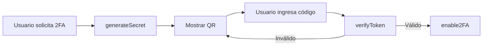
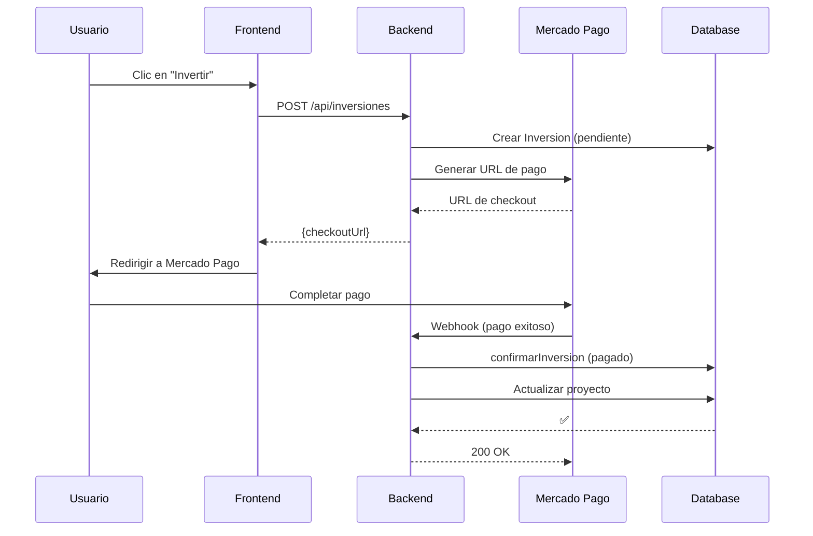
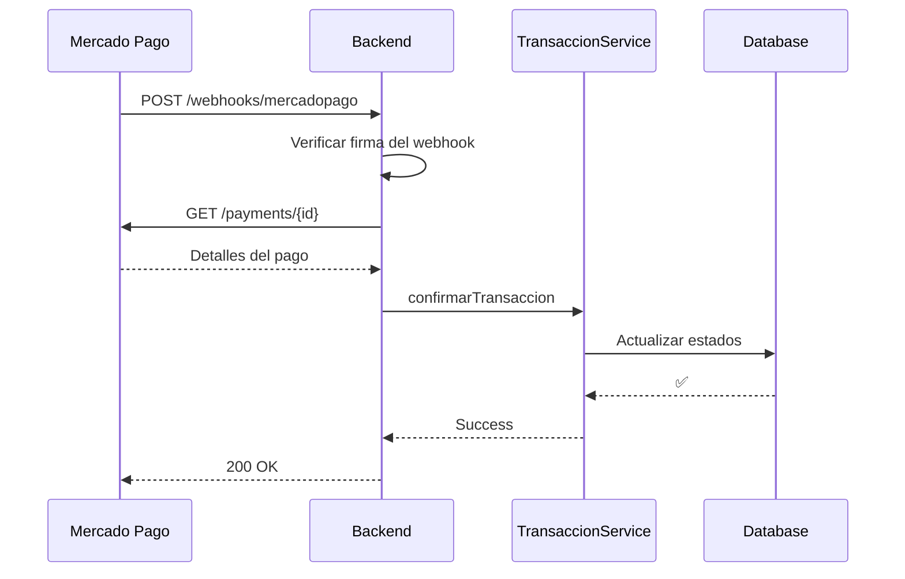
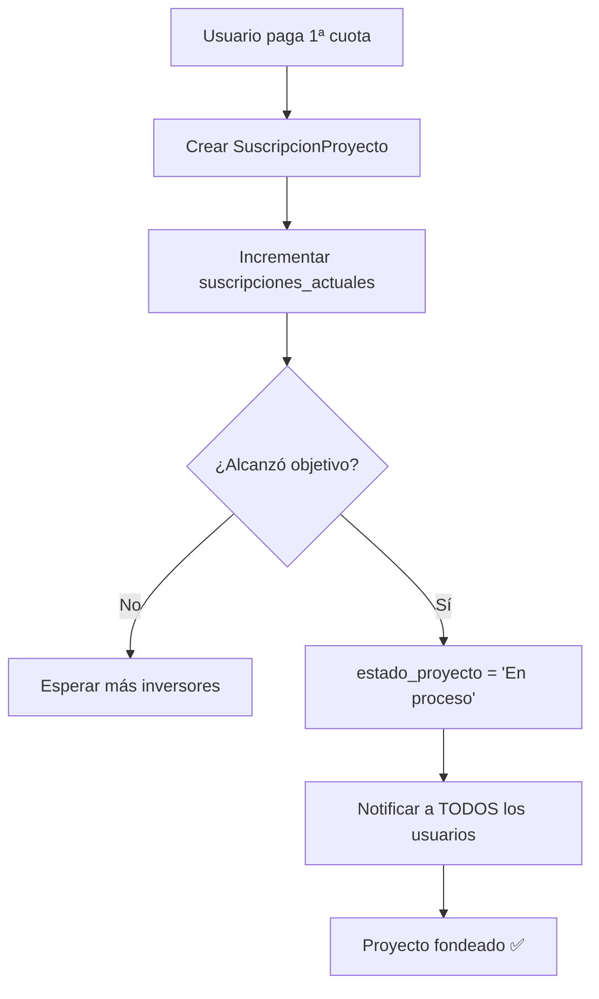
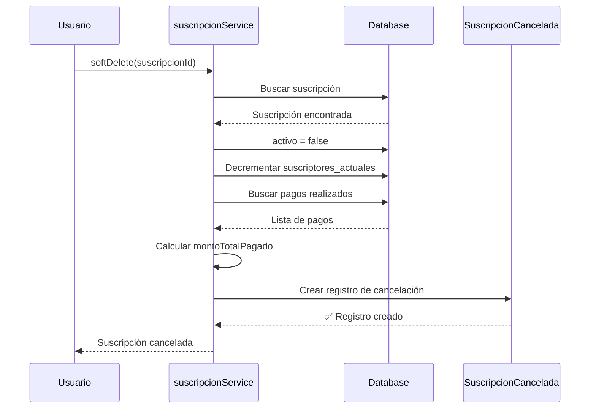
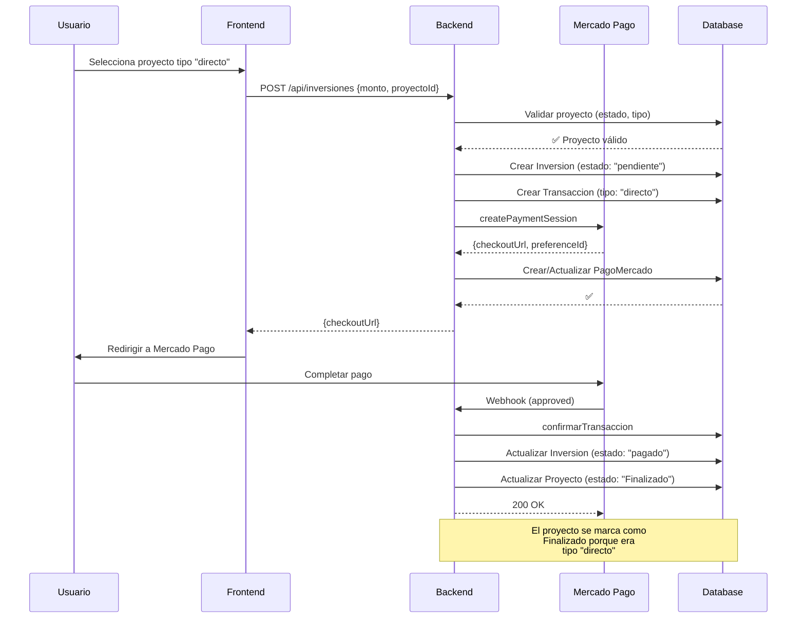
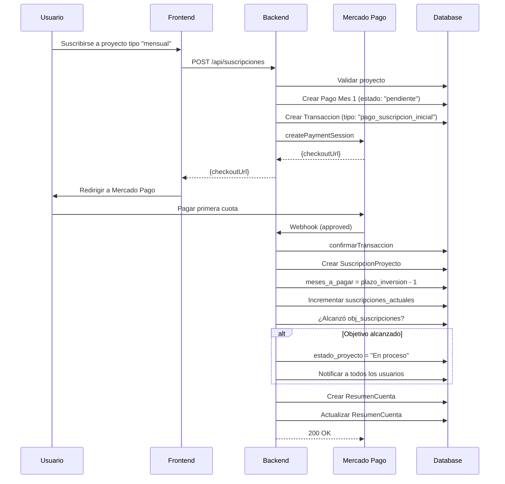
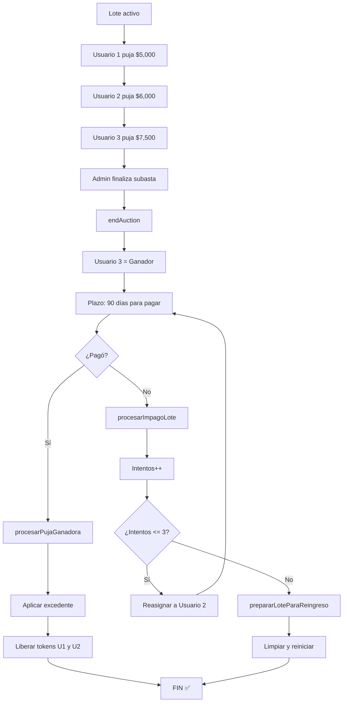
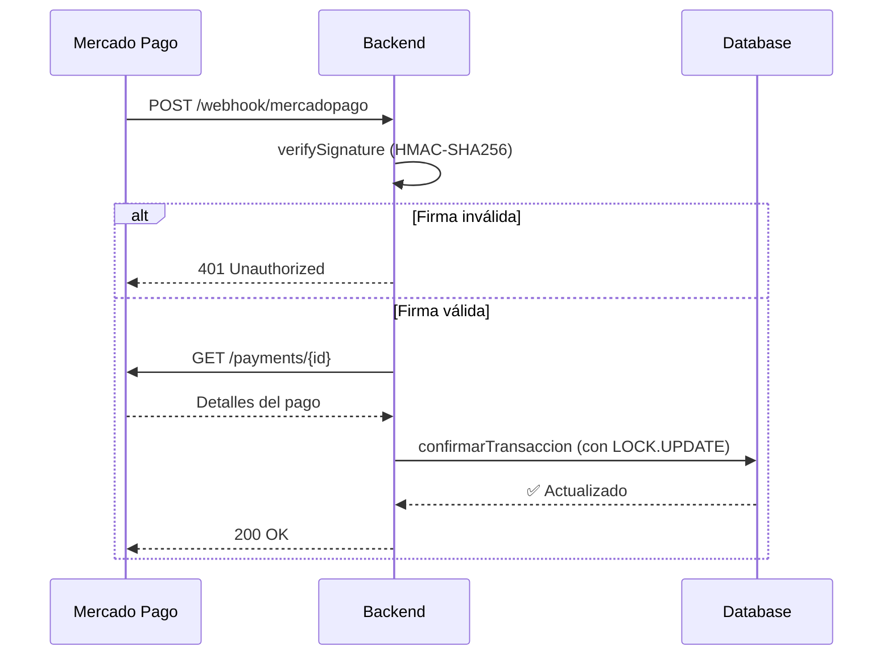

# 🎨 Guía Completa de Integración Frontend

## Nectárea API - Plataforma de Crowdfunding

<div align="center">

**Documentación Técnica para Desarrolladores Frontend**

_Versión 1.0 | Octubre 2025_

</div>

---

## 📋 Tabla de Contenidos

1. [Introducción](#introducción)
2. [Requisitos Previos](#requisitos-previos)
3. [Configuración del Backend](#configuración-del-backend)
4. [Configuración del Frontend](#configuración-del-frontend)
5. [Modelos de Base de Datos](#modelos-de-base-de-datos)
6. [Reglas de Negocio Críticas](#reglas-de-negocio-críticas)
7. [Servicios del Backend](#servicios-del-backend)

---

## 🚀 Introducción

### ¿Qué es Nectárea?

Nectárea es una plataforma de **crowdfunding** (similar a Kickstarter) que permite:

- ✅ **Inversiones directas** en proyectos
- ✅ **Pujas** en subastas de lotes
- ✅ **Suscripciones mensuales** a proyectos
- ✅ **Pagos integrados** con Mercado Pago

### Arquitectura del Sistema

```
┌─────────────────┐      HTTP/REST      ┌─────────────────┐
│                 │ ◄──────────────────► │                 │
│   Frontend      │                      │   Backend API   │
│  (React/Vue)    │                      │   (Node.js)     │
│                 │                      │                 │
└─────────────────┘                      └────────┬────────┘
                                                  │
                                                  │
                                         ┌────────▼────────┐
                                         │   PostgreSQL    │
                                         │   Database      │
                                         └─────────────────┘
```

---

## 📚 Requisitos Previos

### Conocimientos Necesarios

| ✅ **Requeridos**             | ❌ **NO Necesarios**         |
| ----------------------------- | ---------------------------- |
| JavaScript básico             | Node.js/Express internamente |
| HTTP (GET, POST, PUT, DELETE) | PostgreSQL a profundidad     |
| JSON                          | Webhooks internamente        |
| React/Vue/Angular             | Arquitectura de backend      |

### Herramientas Requeridas

| Herramienta                | Versión | Propósito            |
| -------------------------- | ------- | -------------------- |
| **Node.js**                | v18+    | Runtime del backend  |
| **PostgreSQL**             | v14+    | Base de datos        |
| **Git**                    | Latest  | Control de versiones |
| **Postman/Thunder Client** | Latest  | Pruebas de API       |

---

## 🔧 Configuración del Backend

### Paso 1: Clonar el Repositorio

```bash
# Clona el proyecto
git clone https://github.com/SebastianASU2005/Nectarea_BD.git
cd Nectarea_BD

# Instala las dependencias
npm install
```

⏳ _Este proceso tomará unos minutos_

---

### Paso 2: Instalar PostgreSQL

<details>
<summary><b>🪟 Windows</b></summary>

1. Descarga PostgreSQL desde: https://www.postgresql.org/download/windows/
2. Ejecuta el instalador
3. Durante la instalación:
   - Puerto: **5432** (por defecto)
   - Anota la contraseña que elijas
4. Completa la instalación

</details>

<details>
<summary><b>🍎 macOS</b></summary>

```bash
# Instalar con Homebrew
brew install postgresql@14

# Iniciar el servicio
brew services start postgresql@14
```

</details>

<details>
<summary><b>🐧 Linux (Ubuntu/Debian)</b></summary>

```bash
# Actualizar repositorios
sudo apt update

# Instalar PostgreSQL
sudo apt install postgresql postgresql-contrib

# Iniciar el servicio
sudo systemctl start postgresql
```

</details>

---

### Paso 3: Crear la Base de Datos

```bash
# Conectarse a PostgreSQL
psql -U postgres
```

```sql
-- Dentro de la consola de PostgreSQL

-- Crear la base de datos
CREATE DATABASE nectarea_dev;

-- Crear el usuario
CREATE USER nectarea_user WITH PASSWORD 'dev_password_123';

-- Otorgar permisos
GRANT ALL PRIVILEGES ON DATABASE nectarea_dev TO nectarea_user;

-- Salir
\q
```

> ⚠️ **Importante:** Guarda estos datos, los necesitarás en el siguiente paso.

---

### Paso 4: Configurar Variables de Entorno

Crea un archivo `.env` en la raíz del proyecto:

```bash
touch .env
```

Copia y pega la siguiente configuración:

```env
# ═══════════════════════════════════════════════════
#  CONFIGURACIÓN DE ENTORNO - DESARROLLO
# ═══════════════════════════════════════════════════

# --- Entorno ---
NODE_ENV=development

# --- Servidor ---
PORT=3000
HOST_URL=http://localhost:3000
FRONTEND_URL=http://localhost:5173

# --- Base de Datos ---
DB_HOST=localhost
DB_PORT=5432
DB_NAME=nectarea_dev
DB_USER=nectarea_user
DB_PASSWORD=dev_password_123
DB_DIALECT=postgres

# --- JWT (Autenticación) ---
JWT_SECRET=mi_secreto_super_seguro_de_desarrollo_cambiar_en_produccion
JWT_EXPIRES_IN=7d

# --- Mercado Pago (Dejar vacío por ahora) ---
MP_ACCESS_TOKEN=
MP_WEBHOOK_SECRET=
MP_CURRENCY_ID=ARS

# --- Email (Opcional en desarrollo) ---
EMAIL_HOST=smtp.gmail.com
EMAIL_PORT=587
EMAIL_SECURE=false
EMAIL_USER=
EMAIL_PASSWORD=
EMAIL_FROM=noreply@nectarea.com
```

> 🔐 **Seguridad:** Asegúrate de usar los mismos valores que configuraste en el Paso 3.

---

### Paso 5: Inicializar la Base de Datos

```bash
npm run migrate
```

**Salida esperada:**

```
✓ Ejecutando migraciones...
✓ Tabla 'usuarios' creada
✓ Tabla 'proyectos' creada
✓ Tabla 'transacciones' creada
...
✅ Base de datos sincronizada correctamente
```

---

### Paso 6: Iniciar el Backend

```bash
npm run dev
```

**Salida esperada:**

```
✅ Conectado a la base de datos PostgreSQL
✅ Servidor corriendo en http://localhost:3000
⚠️  Mercado Pago SDK no configurado (esperado en desarrollo)
```

---

### Paso 7: Verificar que Funciona

Abre tu navegador y visita:

```
http://localhost:3000/api/health
```

**Respuesta esperada:**

```json
{
  "status": "ok",
  "timestamp": "2025-10-15T10:30:00.000Z"
}
```

✅ **¡Perfecto! El backend está funcionando correctamente.**

---

## ⚙️ Configuración del Frontend

### Paso 1: Crear el Proyecto Frontend

<details>
<summary><b>⚛️ React (con Vite)</b></summary>

```bash
npm create vite@latest nectarea-frontend -- --template react
cd nectarea-frontend
npm install
```

</details>

<details>
<summary><b>💚 Vue (con Vite)</b></summary>

```bash
npm create vite@latest nectarea-frontend -- --template vue
cd nectarea-frontend
npm install
```

</details>

---

### Paso 2: Instalar Axios

```bash
npm install axios
```

---

### Paso 3: Crear el Servicio de API

Crea el archivo: `src/services/api.js`

```javascript
import axios from "axios";

// ═══════════════════════════════════════════════════
//  CONFIGURACIÓN BASE DE LA API
// ═══════════════════════════════════════════════════

const API_URL = import.meta.env.VITE_API_URL || "http://localhost:3000/api";

const apiClient = axios.create({
  baseURL: API_URL,
  timeout: 15000,
  headers: {
    "Content-Type": "application/json",
  },
});

// ═══════════════════════════════════════════════════
//  INTERCEPTOR DE REQUEST
//  Agrega el token automáticamente
// ═══════════════════════════════════════════════════

apiClient.interceptors.request.use(
  (config) => {
    const token = localStorage.getItem("token");

    if (token) {
      config.headers.Authorization = `Bearer ${token}`;
    }

    console.log(`📤 ${config.method.toUpperCase()} ${config.url}`);
    return config;
  },
  (error) => {
    console.error("❌ Error en request:", error);
    return Promise.reject(error);
  }
);

// ═══════════════════════════════════════════════════
//  INTERCEPTOR DE RESPONSE
//  Maneja errores automáticamente
// ═══════════════════════════════════════════════════

apiClient.interceptors.response.use(
  (response) => {
    console.log(`✅ Respuesta recibida de ${response.config.url}`);
    return response;
  },
  (error) => {
    if (error.response) {
      const { status } = error.response;

      // Token expirado o inválido
      if (status === 401) {
        console.error("🚫 Token inválido o expirado");
        localStorage.removeItem("token");
        localStorage.removeItem("user");
        window.location.href = "/login";
      }

      // Sin permisos
      if (status === 403) {
        console.error("🚫 No tienes permisos para esta acción");
      }
    } else if (error.request) {
      console.error("❌ No se pudo conectar con el servidor");
    }

    return Promise.reject(error);
  }
);

export default apiClient;
```

---

### Paso 4: Configurar Variables de Entorno

Crea el archivo `.env` en la raíz de tu proyecto frontend:

```env
VITE_API_URL=http://localhost:3000/api
```

---

### Paso 5: Crear un Servicio de Prueba

Crea el archivo: `src/services/authService.js`

```javascript
import apiClient from "./api";

// ═══════════════════════════════════════════════════
//  SERVICIO DE AUTENTICACIÓN
// ═══════════════════════════════════════════════════

/**
 * Función de prueba de conexión
 */
export const testConnection = async () => {
  try {
    const response = await apiClient.get("/health");
    console.log("✅ Conexión exitosa:", response.data);
    return response.data;
  } catch (error) {
    console.error("❌ Error de conexión:", error);
    throw error;
  }
};
```

---

### Paso 6: Probar la Conexión

Modifica tu `App.jsx` (o `App.vue`):

```jsx
import { useEffect } from "react";
import { testConnection } from "./services/authService";

function App() {
  useEffect(() => {
    testConnection();
  }, []);

  return (
    <div className="App">
      <h1>🍯 Nectárea Frontend</h1>
      <p>Revisa la consola del navegador (F12)</p>
    </div>
  );
}

export default App;
```

---

### Paso 7: Iniciar el Frontend

```bash
npm run dev
```

Abre tu navegador en `http://localhost:5173` y presiona **F12** para ver la consola.

**Salida esperada en la consola:**

```
📤 GET /health
✅ Respuesta recibida de /health
✅ Conexión exitosa: { status: 'ok', timestamp: '...' }
```

✅ **¡Excelente! Tu frontend se comunica con el backend.**

---

## 📊 Modelos de Base de Datos

### ¿Qué es un Modelo?

Un **Modelo** es la representación en código de una **tabla** en la base de datos, definiendo sus columnas, tipos de datos y relaciones.

### Resumen de Modelos

| Modelo                | Tabla                  | Propósito                          |
| --------------------- | ---------------------- | ---------------------------------- |
| `Usuario`             | `usuario`              | Gestión de cuentas y autenticación |
| `Proyecto`            | `proyecto`             | Proyectos de inversión             |
| `Transaccion`         | `transaccion`          | Registro de flujos de dinero       |
| `SuscripcionProyecto` | `suscripcion_proyecto` | Vínculo usuario-proyecto           |
| `Puja`                | `puja`                 | Ofertas en subastas                |
| `Lote`                | `lote`                 | Activos subastados                 |
| `Pago`                | `pago`                 | Cuotas mensuales                   |
| `PagoMercado`         | `pagos_mercado`        | Pagos de pasarela                  |

---

### 1. Usuario (`usuario`)

**Propósito:** Gestión de cuentas de usuario y autenticación.

| Atributo           | Tipo          | Descripción                |
| ------------------ | ------------- | -------------------------- |
| `id`               | `INTEGER`     | 🔑 Clave primaria          |
| `nombre`           | `STRING(100)` | Nombre del usuario         |
| `apellido`         | `STRING(100)` | Apellido del usuario       |
| `email`            | `STRING(255)` | ✉️ Email (único)           |
| `dni`              | `STRING(20)`  | 🆔 DNI (único)             |
| `nombre_usuario`   | `STRING(50)`  | 👤 Username (único)        |
| `contraseña_hash`  | `STRING(255)` | 🔒 Contraseña hasheada     |
| `rol`              | `ENUM`        | 👑 `"admin"` o `"cliente"` |
| `activo`           | `BOOLEAN`     | ✅ Cuenta activa           |
| `confirmado_email` | `BOOLEAN`     | ✉️ Email verificado        |
| `is_2fa_enabled`   | `BOOLEAN`     | 🔐 2FA activo              |
| `twofa_secret`     | `STRING(255)` | 🔑 Clave 2FA               |

---

### 2. Proyecto (`proyecto`)

**Propósito:** Almacena los detalles de cada oportunidad de inversión.

| Atributo                 | Tipo            | Descripción                  |
| ------------------------ | --------------- | ---------------------------- |
| `id`                     | `INTEGER`       | 🔑 Clave primaria            |
| `nombre_proyecto`        | `STRING(255)`   | 📋 Nombre del proyecto       |
| `descripcion`            | `TEXT`          | 📝 Descripción detallada     |
| `tipo_inversion`         | `ENUM`          | 💰 `"directo"` o `"mensual"` |
| `monto_inversion`        | `DECIMAL(18,2)` | 💵 Monto objetivo            |
| `estado_proyecto`        | `ENUM`          | 🚦 Estado actual             |
| `suscripciones_actuales` | `INTEGER`       | 👥 Contador de inversores    |
| `fecha_inicio`           | `DATEONLY`      | 📅 Fecha de inicio           |
| `fecha_cierre`           | `DATEONLY`      | 📅 Fecha de cierre           |
| `pack_de_lotes`          | `BOOLEAN`       | 📦 Gestiona subastas         |

**Estados Posibles:**

- 🟡 `"En Espera"` - Esperando fondeo
- 🟢 `"En proceso"` - Fondeado y activo
- 🔵 `"Finalizado"` - Completado

---

### 3. Transacción (`transaccion`)

**Propósito:** Registro central de todos los flujos de dinero.

| Atributo             | Tipo            | Descripción                 |
| -------------------- | --------------- | --------------------------- |
| `id`                 | `INTEGER`       | 🔑 Clave primaria           |
| `id_usuario`         | `INTEGER`       | 👤 Usuario que transacciona |
| `monto`              | `DECIMAL(15,2)` | 💰 Monto de la transacción  |
| `tipo_transaccion`   | `STRING(50)`    | 📊 Tipo de operación        |
| `estado_transaccion` | `ENUM`          | 🚦 Estado del pago          |

**Estados Posibles:**

- 🟡 `"pendiente"` - Esperando confirmación
- 🟢 `"pagado"` - Pago exitoso
- 🔴 `"fallido"` - Pago rechazado
- 🔵 `"reembolsado"` - Devuelto al usuario

---

### 4. Puja (`puja`)

**Propósito:** Registro de ofertas en subastas de lotes.

| Atributo                 | Tipo            | Descripción          |
| ------------------------ | --------------- | -------------------- |
| `id`                     | `INTEGER`       | 🔑 Clave primaria    |
| `id_lote`                | `INTEGER`       | 📦 Lote subastado    |
| `id_usuario`             | `INTEGER`       | 👤 Usuario que puja  |
| `monto_puja`             | `DECIMAL(15,2)` | 💰 Monto ofertado    |
| `estado_puja`            | `ENUM`          | 🚦 Estado de la puja |
| `fecha_vencimiento_pago` | `DATE`          | ⏰ Límite de pago    |

**Estados Posibles:**

- 🟢 `"activa"` - Puja en curso
- 🟡 `"ganadora_pendiente"` - Ganó, esperando pago
- 🔴 `"perdedora"` - No ganó la subasta
- ⚫ `"ganadora_incumplimiento"` - No pagó a tiempo

---

## 🎯 Reglas de Negocio Críticas

### ¿Qué son las Reglas de Negocio?

Las **reglas de negocio** son restricciones y validaciones que el backend implementa para mantener la integridad de los datos. Si no las respetas en el frontend, tus requests fallarán.

### ¿Por qué es crítico conocerlas?

- ✅ Evitarás errores 400, 409 y 500
- ✅ Entenderás por qué ciertas acciones requieren verificaciones previas
- ✅ Sabrás qué datos validar antes de enviarlos
- ✅ Implementarás la UI correctamente

---

## 🔧 Servicios del Backend

### 🔐 1. Servicio de Seguridad (authService)

**Propósito:** Manejo seguro de contraseñas y autenticación.

**Librería:** `bcryptjs`

#### Métodos Principales

| Método            | Propósito            | Regla Crítica                                     |
| ----------------- | -------------------- | ------------------------------------------------- |
| `hashPassword`    | Hashea contraseñas   | 🚫 **NUNCA** almacenar contraseñas en texto plano |
| `comparePassword` | Verifica contraseñas | Usado en login para validar credenciales          |

**Ejemplo de uso:**

```javascript
// Registro
const hashedPassword = await authService.hashPassword("miPassword123");
// Guardar hashedPassword en la DB

// Login
const esValido = await authService.comparePassword(
  "miPassword123",
  usuario.contraseña_hash
);
```

> ⚠️ **Importante:** El factor de salt de 10 es el estándar de seguridad.

---

### 🔐 2. Servicio de Autenticación 2FA (auth2faService)

**Propósito:** Gestión de autenticación de dos factores (TOTP).

**Librería:** `speakeasy`

#### Métodos Principales

| Método           | Propósito         | Regla Crítica                    |
| ---------------- | ----------------- | -------------------------------- |
| `generateSecret` | Genera código QR  | Incluye email del usuario        |
| `verifyToken`    | Valida código 2FA | Ventana de ±30 segundos          |
| `enable2FA`      | Activa 2FA        | Solo después de validar token    |
| `disable2FA`     | Desactiva 2FA     | Requiere contraseña + código 2FA |

#### Flujo de Activación 2FA



---

### 📄 3. Servicio de Contratos (contratoService)

**Propósito:** Gestión e integridad criptográfica de documentos legales.

#### Métodos Principales

| Método              | Propósito           | Regla Crítica                         |
| ------------------- | ------------------- | ------------------------------------- |
| `create`            | Registra contrato   | Requiere `hash_archivo_original`      |
| `findAndVerifyById` | Verifica integridad | Compara hash almacenado vs actual     |
| `registerSignature` | Vincula firma       | Asocia inversión con contrato firmado |

#### Verificación de Integridad

```javascript
// El sistema compara hashes
const hashActual = await generateFileHash(contrato.url_archivo);

if (hashActual !== contrato.hash_archivo_original) {
  // ⚠️ ¡ARCHIVO MODIFICADO!
  contrato.integrity_compromised = true;
}
```

> 🔒 **Seguridad:** Si el hash no coincide, el archivo fue alterado.

---

### 💰 4. Servicio de Cuotas Mensuales (cuotaMensualService)

**Propósito:** Cálculo del monto mensual para suscripciones.

#### Fórmula de Cálculo

```
1. Costo Base = valor_cemento_unidades × valor_cemento
2. Total del Plan = Costo Base × (porcentaje_plan / 100)
3. Valor Mensual = Total del Plan / total_cuotas
4. Carga Admin = Costo Base × (porcentaje_admin / 100)
5. IVA = Carga Admin × (porcentaje_iva / 100)
6. VALOR FINAL = Valor Mensual + Carga Admin + IVA
```

> 💡 **Nota:** Todos los valores se redondean a 2 decimales.

---

### 📧 5. Servicio de Email (emailService)

**Propósito:** Envío de correos transaccionales.

**Librería:** `nodemailer`

#### Métodos Principales

| Método                  | Cuándo se Envía    | Propósito                 |
| ----------------------- | ------------------ | ------------------------- |
| `sendConfirmationEmail` | Al registrarse     | Activar cuenta            |
| `notificarGanadorPuja`  | Al ganar subasta   | Informar victoria y plazo |
| `notificarImpago`       | Después de 90 días | Informar pérdida del lote |

---

### 🖼️ 6. Servicio de Imágenes (imagenService)

**Propósito:** Gestión de contenido visual.

**Concepto Clave:** Borrado suave (soft delete)

```javascript
// No elimina físicamente, solo marca como inactivo
await imagenService.softDelete(imagenId);

// Consulta solo imágenes activas
const imagenes = await imagenService.findByProjectIdActivo(proyectoId);
```

> ✅ **Beneficio:** Mantiene historial y permite auditoría.

---

### 💼 7. Servicio de Inversiones (inversionService)

**Propósito:** Gestión de inversiones en proyectos.

#### Flujo de Inversión



---

### 🔑 8. Servicio de JWT (jwtService)

**Propósito:** Creación y verificación de tokens de sesión.

**Librería:** `jsonwebtoken`

#### Tipos de Tokens

| Tipo       | Duración  | Contenido                     | Uso                            |
| ---------- | --------- | ----------------------------- | ------------------------------ |
| **Sesión** | 1 hora    | `id`, `nombre_usuario`, `rol` | Operaciones diarias            |
| **2FA**    | 5 minutos | Solo `id`                     | Verificación de segundo factor |

**Ejemplo de payload:**

```json
{
  "id": 42,
  "nombre_usuario": "admin_pablo",
  "rol": "administrador",
  "iat": 1634283600,
  "exp": 1634287200
}
```

> 🔐 **Crítico:** La variable `JWT_SECRET` debe ser larga y compleja en producción.

---

### 🏆 9. Servicio de Lotes y Subastas (loteService)

**Propósito:** Gestión completa del ciclo de vida de las subastas.

#### Métodos Críticos

| Método                      | Propósito        | Lógica de Negocio                         |
| --------------------------- | ---------------- | ----------------------------------------- |
| `endAuction`                | Finaliza subasta | Asigna ganador, plazo de 90 días          |
| `procesarImpagoLote`        | Maneja impagos   | Después de 90 días, reasigna al siguiente |
| `asignarSiguientePuja`      | Reasignación     | Ofrece al 2º postor                       |
| `prepararLoteParaReingreso` | Limpia lote      | Después de 3 intentos fallidos            |

#### Flujo de Subasta

```
1. Subasta Activa
   ↓
2. endAuction → Ganador P1 (90 días para pagar)
   ↓
3a. ✅ Paga → procesarPujaGanadora
   ↓
   Aplica excedente, libera tokens

3b. ❌ No paga → procesarImpagoLote
   ↓
   Reasigna a P2 (90 días)
   ↓
   Si P2 no paga → Reasigna a P3
   ↓
   Si P3 no paga → prepararLoteParaReingreso
```

---

### 💬 10. Servicio de Mensajes (mensajeService)

**Propósito:** Sistema de mensajería interno.

**Regla Crítica:** Usuario del Sistema (ID = 1)

```javascript
// Mensaje automático del sistema
await mensajeService.enviarMensajeSistema(
  userId,
  "¡Felicidades! Has ganado el Lote #10."
);
// El remitente será siempre el ID 1 (Sistema)
```

---

### 💳 11. Servicio de Pagos (pagoService)

**Propósito:** Gestión de cuotas mensuales y descuentos.

#### Método Clave: `generarPagoMensualConDescuento`

```javascript
// Lógica de descuento
const saldoAFavor = suscripcion.saldo_a_favor;
const montoAPagar = Math.max(0, cuotaMensual - saldoAFavor);

if (montoAPagar === 0) {
  // Cuota cubierta completamente por saldo
  estado_pago = "cubierto_por_puja";
} else {
  estado_pago = "pendiente";
}
```

---

### 💰 12. Servicio de Pagos Mercado Pago (paymentService)

**Propósito:** Integración con la pasarela de pagos.

#### Flujo de Webhook



---

### 🏗️ 13. Servicio de Proyectos (proyectoService)

**Propósito:** Creación y validación de proyectos.

#### Validaciones por Tipo

| Tipo        | Moneda | Lotes    | Requisito                  |
| ----------- | ------ | -------- | -------------------------- |
| **directo** | USD    | ✅ true  | `monto_inversion` definido |
| **mensual** | ARS    | ❌ false | `obj_suscripciones` > 0    |

```javascript
// Validación de unicidad de lotes
const lotesAsignados = await Lote.findAll({
  where: {
    id: lotesIds,
    idProyecto: { [Op.ne]: null }, // Ya están asignados
  },
});

if (lotesAsignados.length > 0) {
  throw new Error("Los lotes ya están asignados a otro proyecto");
}
```

---

### 🎯 14. Servicio de Pujas (pujaService)

**Propósito:** Gestión de ofertas y sistema de tokens.

#### Sistema de Tokens

```
Usuario suscrito → 1 token disponible
   ↓
Primera puja en Lote A → Consume el token
   ↓
No puede pujar en Lote B (mismo proyecto)
   ↓
Pierde la subasta → Token liberado
   ↓
Puede pujar en otro proyecto
```

#### Método Clave: `procesarPujaGanadora`

**Jerarquía de Aplicación del Excedente:**

```
Monto de Puja - Precio Base = EXCEDENTE
   ↓
1️⃣ Cubrir Pagos Pendientes
   ↓
2️⃣ Pre-pagar Meses Futuros
   ↓
3️⃣ Saldo a Favor (próximas cuotas)
   ↓
4️⃣ Excedente de Visualización
```

**Ejemplo:**

```javascript
// Usuario puja $10,000 por un lote de precio base $5,000
const excedente = 10000 - 5000; // $5,000

// Tiene 2 cuotas pendientes de $1,000 cada una
// Resultado:
// - Cuota 1: Cubierta ($1,000)
// - Cuota 2: Cubierta ($1,000)
// - Excedente restante: $3,000 → saldo_a_favor
```

---

### 📊 15. Servicio de Resumen de Cuenta (resumenCuentaService)

**Propósito:** Dashboard financiero del usuario.

#### Cálculo de Morosidad

```javascript
// Meses transcurridos desde la suscripción
const mesesTranscurridos = moment().diff(
  moment(suscripcion.createdAt),
  "months"
);

// Cuotas que deberían estar pagadas
const cuotasEsperadas = mesesTranscurridos;

// Cuotas realmente pagadas
const cuotasPagadas = await Pago.count({
  where: {
    id_suscripcion: suscripcionId,
    estado_pago: ["pagado", "cubierto_por_puja"],
  },
});

// Morosidad
const cuotasVencidas = Math.max(0, cuotasEsperadas - cuotasPagadas);
```

---

### 🔄 16. Servicio de Suscripciones (suscripcionProyectoService)

**Propósito:** Gestión del ciclo de vida de las suscripciones.

#### Flujo de Fondeo del Proyecto



**Código clave:**

```javascript
// Verificar si se alcanzó el objetivo
if (proyecto.suscripciones_actuales >= proyecto.obj_suscripciones) {
  proyecto.estado_proyecto = "En proceso";
  proyecto.objetivo_notificado = true;

  // Notificar a todos
  const usuarios = await Usuario.findAll({ where: { activo: true } });
  for (const usuario of usuarios) {
    await mensajeService.enviarMensajeSistema(
      usuario.id,
      `¡El proyecto "${proyecto.nombre_proyecto}" ha sido fondeado!`
    );
  }
}
```

---

### ❌ 17. Servicio de Bajas (suscripcionService)

**Propósito:** Cancelación de suscripciones con registro para reembolso.

#### Flujo de Cancelación



**Datos guardados para reembolso:**

```javascript
{
  id_suscripcion_original: 123,
  id_usuario: 45,
  id_proyecto: 10,
  meses_pagados: 8,
  monto_pagado_total: 24000.00,
  fecha_cancelacion: "2025-10-15"
}
```

> 💡 **Uso:** El equipo administrativo usa esta tabla para procesar reembolsos.

---

### 💸 18. Servicio de Transacciones (transaccionService)

**Propósito:** Motor central de pagos y confirmaciones.

#### Método Crítico: `confirmarTransaccion`

**Switch de Lógica de Negocio:**

```javascript
switch (transaccion.tipo_transaccion) {
  case "pago_suscripcion_inicial":
    // 1. Crear SuscripcionProyecto
    // 2. Vincular Pago
    // 3. Decrementar meses_a_pagar
    // 4. Crear ResumenCuenta
    // 5. Actualizar resumen
    break;

  case "mensual":
    // 1. Marcar Pago como pagado
    // 2. Decrementar meses_a_pagar
    // 3. Actualizar ResumenCuenta
    break;

  case "directo":
    // 1. Confirmar Inversión
    // 2. Finalizar Proyecto (si es tipo directo)
    break;

  case "Puja":
    // 1. Aplicar excedente (procesarPujaGanadora)
    // 2. Liberar tokens de perdedores
    // 3. Marcar puja como pagada
    break;
}
```

#### Gestión de Saldo (Billetera)

| Operación        | Efecto en Saldo         |
| ---------------- | ----------------------- |
| **Pago exitoso** | `-monto` (sale dinero)  |
| **Reembolso**    | `+monto` (entra dinero) |

```javascript
// Confirmar pago
await resumenCuentaService.actualizarSaldoGeneral(
  userId,
  -transaccion.monto // Resta
);

// Revertir pago
await resumenCuentaService.actualizarSaldoGeneral(
  userId,
  transaccion.monto // Suma
);
```

---

### 👤 19. Servicio de Usuarios (usuarioService)

**Propósito:** Gestión de cuentas y seguridad.

#### Tokens de Seguridad

| Tipo                   | Vigencia | Uso                  |
| ---------------------- | -------- | -------------------- |
| `confirmacion_token`   | 24 horas | Activar cuenta       |
| `reset_password_token` | 1 hora   | Recuperar contraseña |

#### Método: `cleanUnconfirmedAccounts`

**Limpieza automática (Cron Job):**

```javascript
// Elimina cuentas no confirmadas después de 7 días
const cuentasEliminadas = await Usuario.destroy({
  where: {
    confirmado_email: false,
    createdAt: {
      [Op.lt]: new Date(Date.now() - 7 * 24 * 60 * 60 * 1000),
    },
  },
});
```

> 🧹 **Beneficio:** Mantiene la base de datos limpia de registros abandonados.

---

## 📚 Flujos Completos de Negocio

### 🎯 Flujo 1: Inversión Directa



---

### 💳 Flujo 2: Suscripción Mensual (Primera Cuota)



---

### 🏆 Flujo 3: Subasta de Lote



---

### 💰 Flujo 4: Aplicación de Excedente de Puja

```javascript
/**
 * Ejemplo: Usuario gana con puja de $10,000
 * Precio base del lote: $4,000
 * Excedente: $6,000
 */

// Estado de la suscripción:
// - 3 cuotas pendientes de $1,000 c/u
// - meses_a_pagar: 12

// Paso 1: Cubrir pagos pendientes
const pagosPendientes = [
  { id: 1, monto: 1000 },
  { id: 2, monto: 1000 },
  { id: 3, monto: 1000 },
];

let excedente = 6000;

// Marcar como "cubierto_por_puja"
for (const pago of pagosPendientes) {
  if (excedente >= pago.monto) {
    await pago.update({ estado_pago: "cubierto_por_puja" });
    excedente -= pago.monto; // $6,000 → $5,000 → $4,000 → $3,000
  }
}

// Paso 2: Pre-pagar meses futuros
const cuotaMensual = 1000;
while (excedente >= cuotaMensual && suscripcion.meses_a_pagar > 0) {
  await suscripcion.decrement("meses_a_pagar");
  excedente -= cuotaMensual; // $3,000 → $2,000 → $1,000 → $0
}

// Paso 3: Saldo a favor
if (excedente > 0 && suscripcion.meses_a_pagar > 0) {
  await suscripcion.increment("saldo_a_favor", { by: excedente });
}

// Paso 4: Excedente de visualización
if (suscripcion.meses_a_pagar === 0 && excedente > 0) {
  await lote.update({ excedente_visualizacion: excedente });
}

// Resultado:
// - 3 cuotas cubiertas
// - 3 meses pre-pagados (12 → 9)
// - meses_a_pagar: 9
// - saldo_a_favor: $0
```

---

### 📅 Flujo 5: Generación Automática de Cuotas (Cron Job)

```javascript
/**
 * Se ejecuta el día 1 de cada mes a las 00:00
 */

// Buscar suscripciones activas con meses pendientes
const suscripciones = await SuscripcionProyecto.findAll({
  where: {
    activo: true,
    meses_a_pagar: { [Op.gt]: 0 }
  },
  include: [{ model: Proyecto }]
});

for (const suscripcion of suscripciones) {
  // Generar el pago del próximo mes
  await pagoService.generarPagoMensualConDescuento(suscripcion.id);
}

/**
 * generarPagoMensualConDescuento hace:
 * 1. Buscar el último pago para determinar el mes
 * 2. Aplicar saldo_a_favor si existe
 * 3. Crear el Pago con fecha_vencimiento = día 10
 * 4. Si saldo cubre todo: estado = "cubierto_por_puja"
 * 5. Si no: estado = "pendiente"
 */

📋 Documentación de Controladores y Rutas API
📑 Índice de Controladores
#ControladorPropósitoSección1auth.controller.jsAutenticación y seguridad de accesoVer2auth2fa.controller.jsConfiguración de autenticación de dos factoresVer3contrato.controller.jsGestión de contratos y seguridad documentalVer4cuota_mensual.controller.jsGestión de cuotas mensualesVer5imagen.controller.jsGestión de archivos multimediaVer6inversion.controller.jsInversiones y checkout seguroVer7lote.controller.jsLotes y subastasVer8mensaje.controller.jsSistema de mensajería internaVer9pago.controller.jsGestión de pagos y checkout con 2FAVer10pagoMercado.controller.jsIntegración con Mercado PagoVer11proyecto.controller.jsGestión de proyectosVer12puja.controller.jsSistema de pujas y subastasVer13redireccion.controller.jsRedirección post-pagoVer14resumen_cuenta.controller.jsResúmenes de cuentaVer15suscripcion_proyecto.controller.jsSuscripciones a proyectosVer16suscripcion.controller.jsGestión de suscripciones genéricasVer17transaccion.controller.jsTransacciones y flujo de pagoVer18usuario.controller.jsGestión de usuariosVer

7️⃣ Controladores y Rutas
¿Qué es un Controlador?
Los controladores son la capa de orquestación entre las peticiones HTTP del frontend y la lógica de negocio (servicios). Actúan como intermediarios que:

✅ Validan los datos de entrada
✅ Llaman a los servicios correspondientes
✅ Formatean las respuestas HTTP
✅ Manejan errores de forma consistente


7.1. Autenticación (auth.controller.js)
Descripción
Maneja el flujo más crítico de la API: autenticación, gestión de contraseñas, tokens JWT, estados de cuenta y Autenticación de Doble Factor (2FA).
Funciones del Controlador
FunciónPropósitoLógica CríticaCódigos HTTPregisterRegistra un nuevo usuario1. Hashea la contraseña con authService.hashPassword()<br>2. Persiste el usuario con usuarioService.create()<br>3. Genera y envía token de confirmación por email201 Created<br>400 Bad RequestloginInicia sesión1. Verifica credenciales con authService.comparePassword()<br>2. Bloquea si cuenta está inactiva o sin confirmar (403)<br>3. Si 2FA activo: emite twoFaToken temporal (5 min) → 202<br>4. Si NO 2FA: emite JWT de sesión → 200200 OK<br>202 Accepted (2FA)<br>401 Unauthorized<br>403 Forbiddenverify2FACompleta login tras 2FA1. Valida twoFaToken temporal<br>2. Verifica código TOTP con auth2faService.verifyToken()<br>3. Emite JWT de sesión final200 OK<br>401 UnauthorizedforgotPasswordRecuperación de contraseñaLlama a usuarioService.generatePasswordResetToken() y envía email.<br>⚠️ Siempre devuelve 200 (evita enumeración de emails)200 OKresetPasswordAplica nueva contraseña1. Verifica validez y expiración del token<br>2. Hashea nueva contraseña<br>3. Actualiza BD y limpia tokens200 OK<br>400 Bad RequestconfirmarEmailActiva la cuentaLlama a usuarioService.confirmEmail() para cambiar confirmado_email a true200 OK<br>400 Bad RequestlogoutCierra sesiónConfirma cierre al cliente.<br>⚠️ El frontend debe eliminar el JWT200 OK
Endpoints de Autenticación
POST   /api/auth/register                    → authController.register
POST   /api/auth/login                       → authController.login
POST   /api/auth/2fa/verify                  → authController.verify2FA
POST   /api/auth/forgot-password             → authController.forgotPassword
POST   /api/auth/reset-password/:token       → authController.resetPassword
POST   /api/auth/reenviar_confirmacion       → authController.resendConfirmation
GET    /api/auth/confirmar_email/:token      → authController.confirmarEmail
POST   /api/auth/logout [🔒]                 → authController.logout
POST   /api/auth/2fa/generate-secret [🔒]    → auth2faController.generate2FASecret
POST   /api/auth/2fa/enable [🔒]             → auth2faController.verifyAndEnable2FA
POST   /api/auth/2fa/disable [🔒]            → auth2faController.disable2FA

🔒 = Requiere authenticate middleware (JWT válido)


7.2. Configuración 2FA (auth2fa.controller.js)
Descripción
Gestiona la activación, desactivación y verificación de Autenticación de Dos Factores (TOTP). Todas las operaciones requieren JWT válido.
Funciones del Controlador
FunciónPropósitoLógica CríticaCódigos HTTPgenerate2FASecretGenera QR para setup inicial1. Valida que 2FA NO esté habilitado ya<br>2. Llama a auth2faService.generateSecret() con email del usuario<br>3. Almacena secret temporalmente en twofa_secret (BD)200 OK (devuelve otpauthUrl y secret)<br>400 Bad RequestverifyAndEnable2FAActiva 2FA permanentemente1. Valida que el secret exista en BD<br>2. Verifica código TOTP con auth2faService.verifyToken()<br>3. Llama a auth2faService.enable2FA() para setear is_2fa_enabled = true200 OK<br>401 Unauthorized<br>400 Bad Requestdisable2FADesactiva 2FA1. Requiere contraseña + código TOTP actual<br>2. auth2faService.disable2FA() compara contraseña y verifica TOTP<br>3. Si ambos correctos: is_2fa_enabled = false y limpia twofa_secret200 OK<br>400 Bad Request
Flujo de Activación 2FA
mermaidgraph LR
    A[Usuario solicita 2FA] --> B[generate2FASecret]
    B --> C[Mostrar QR al usuario]
    C --> D[Usuario escanea con app]
    D --> E[Usuario ingresa código de prueba]
    E --> F[verifyAndEnable2FA]
    F -->|Código válido| G[2FA activado ✅]
    F -->|Código inválido| E
```

---

## 7.3. Contratos (`contrato.controller.js`)

### Descripción

Centraliza la gestión de contratos y firmas, aplicando reglas estrictas de autorización y garantizando integridad mediante hashes criptográficos.

### Funciones del Controlador

| Función           | Propósito                    | Lógica Crítica                                                                                                                                                                                  | Códigos HTTP                                                |
| ----------------- | ---------------------------- | ----------------------------------------------------------------------------------------------------------------------------------------------------------------------------------------------- | ----------------------------------------------------------- |
| `upload`          | Sube plantilla de contrato   | 1. **Solo Admin** (`req.user.role === 'admin'`)<br>2. Calcula `hash_archivo_original` del archivo<br>3. Si falla registro, elimina archivo físico                                               | **201** Created<br>**403** Forbidden<br>**400** Bad Request |
| `sign`            | Registra contrato firmado    | 1. Verifica que usuario sea dueño de `id_inversion` o `id_suscripcion`<br>2. Calcula `hash_documento_firmado`<br>3. Llama a `contratoService.registerSignature()`<br>4. Limpia archivo si falla | **200** OK<br>**403** Forbidden<br>**404** Not Found        |
| `findMyContracts` | Lista contratos del usuario  | Llama a `contratoService.findByUserId(userId)`                                                                                                                                                  | **200** OK                                                  |
| `findById`        | Obtiene detalles de contrato | 1. Verifica integridad (`integrity_compromised`)<br>2. Autoriza si: es Admin, es Firmante, o tiene Inversión/Suscripción<br>3. Elimina datos sensibles antes de enviar                          | **200** OK<br>**409** Conflict<br>**403** Forbidden         |
| `download`        | Descarga segura del archivo  | Aplica mismas validaciones que `findById` + `res.download()`                                                                                                                                    | **200** OK<br>**409** Conflict<br>**403** Forbidden         |
| `softDelete`      | Marca contrato como inactivo | Llama a `contratoService.softDelete(id)`                                                                                                                                                        | **200** OK<br>**404** Not Found                             |

### Endpoints de Contratos

```
POST   /api/contratos/upload [🔒👑]                     → upload
POST   /api/contratos/firmar [🔒]                       → sign
GET    /api/contratos/ [🔒👑]                           → findAll
GET    /api/contratos/mis_contratos [🔒]                → findMyContracts
GET    /api/contratos/descargar/:id [🔒]                → download
GET    /api/contratos/:id [🔒]                          → findById
DELETE /api/contratos/:id [🔒👑]                        → softDelete

👑 = Requiere rol admin (además de autenticación)

Verificación de Integridad
javascript// El sistema compara hashes automáticamente
const hashActual = await generateFileHash(contrato.url_archivo);

if (hashActual !== contrato.hash_archivo_original) {
  // ⚠️ ARCHIVO MODIFICADO - Integridad comprometida
  contrato.integrity_compromised = true;
}
```

---

## 7.4. Cuotas Mensuales (`cuota_mensual.controller.js`)

### Descripción

Gestiona la creación y consulta de cuotas asociadas a proyectos. **Creación y modificación restringidas a Admin**.

### Funciones del Controlador

| Función               | Propósito                     | Lógica Crítica                                                                                                                                                                                               | Códigos HTTP                                                |
| --------------------- | ----------------------------- | ------------------------------------------------------------------------------------------------------------------------------------------------------------------------------------------------------------ | ----------------------------------------------------------- |
| `create`              | Registra nueva cuota          | 1. Valida existencia de `id_proyecto`<br>2. Obtiene datos del proyecto con `proyectoService.findById()`<br>3. Llama a `cuotaMensualService.createAndSetProjectAmount()` (crea cuota + ajusta monto proyecto) | **201** Created<br>**400** Bad Request<br>**404** Not Found |
| `findByProjectId`     | Lista cuotas de un proyecto   | Llama a `cuotaMensualService.findByProjectId(id_proyecto)`                                                                                                                                                   | **200** OK                                                  |
| `findLastByProjectId` | Obtiene cuota más reciente    | Llama a `cuotaMensualService.findLastByProjectId(id_proyecto)`                                                                                                                                               | **200** OK<br>**404** Not Found                             |
| `update`              | Modifica cuota existente      | Llama a `cuotaMensualService.update(id, data)`                                                                                                                                                               | **200** OK<br>**404** Not Found                             |
| `softDelete`          | Elimina lógicamente una cuota | Llama a `cuotaMensualService.softDelete(id)`                                                                                                                                                                 | **200** OK<br>**404** Not Found                             |

### Endpoints de Cuotas

```
POST   /api/cuotas/ [🔒👑]                    → create
GET    /api/cuotas/:id_proyecto [🔒]          → findByProjectId
GET    /api/cuotas/:id_proyecto/last [🔒]     → findLastByProjectId
PUT    /api/cuotas/:id [🔒👑]                 → update
DELETE /api/cuotas/:id [🔒👑]                 → softDelete
```

---

## 7.5. Imágenes (`imagen.controller.js`)

### Descripción

Administra subida, consulta y eliminación lógica de imágenes asociadas a Proyectos y Lotes. Utiliza **Multer** para manejo de archivos.

### Funciones del Controlador

| Función                | Propósito                                  | Lógica Crítica                                                                                                                                                  | Códigos HTTP                           |
| ---------------------- | ------------------------------------------ | --------------------------------------------------------------------------------------------------------------------------------------------------------------- | -------------------------------------- |
| `create`               | Sube imagen y registra en BD               | 1. Verifica que `req.file` exista (Multer)<br>2. Valida asociación a `id_proyecto` o `id_lote`<br>3. Usa `req.file.path` como URL para `imagenService.create()` | **201** Created<br>**400** Bad Request |
| `getImagesByProjectId` | Lista imágenes activas de proyecto         | Llama a `imagenService.findByProjectIdActivo(id_proyecto)`                                                                                                      | **200** OK                             |
| `getImagesByLoteId`    | Lista imágenes activas de lote             | Llama a `imagenService.findByLoteIdActivo(id_lote)`                                                                                                             | **200** OK                             |
| `findByIdActivo`       | Obtiene imagen activa por ID               | Llama a `imagenService.findByIdActivo(id)` (ruta para usuarios)                                                                                                 | **200** OK<br>**404** Not Found        |
| `findById`             | Obtiene imagen por ID (incl. inactivas)    | Llama a `imagenService.findById(id)` (solo Admin)                                                                                                               | **200** OK<br>**404** Not Found        |
| `findAllActivo`        | Lista todas las imágenes activas           | Llama a `imagenService.findAllActivo()`                                                                                                                         | **200** OK                             |
| `findAll`              | Lista todas las imágenes (incl. inactivas) | Llama a `imagenService.findAll()` (solo Admin)                                                                                                                  | **200** OK                             |
| `update`               | Actualiza metadatos de imagen              | Llama a `imagenService.update(id, data)` (no maneja nuevo archivo)                                                                                              | **200** OK<br>**404** Not Found        |
| `softDelete`           | Marca imagen como eliminada                | Llama a `imagenService.softDelete(id)` (`activo: false`)                                                                                                        | **200** OK<br>**404** Not Found        |

### Endpoints de Imágenes

```
POST   /api/imagenes/ [🔒👑 + Multer]            → create
GET    /api/imagenes/proyecto/:idProyecto [🔒]   → getImagesByProjectId
GET    /api/imagenes/lote/:idLote [🔒]           → getImagesByLoteId
GET    /api/imagenes/activas [🔒]                → findAllActivo
GET    /api/imagenes/ [🔒👑]                     → findAll
GET    /api/imagenes/admin/:id [🔒👑]            → findById
GET    /api/imagenes/:id [🔒]                    → findByIdActivo
PUT    /api/imagenes/:id [🔒👑]                  → update
DELETE /api/imagenes/:id [🔒👑]                  → softDelete
```

> ⚠️ **Orden de rutas crítico**: rutas con prefijos (`/proyecto/`, `/lote/`, `/admin/`) antes que `/:id`

---

## 7.6. Inversiones (`inversion.controller.js`)

### Descripción

Maneja el ciclo de vida de inversiones, implementando **control de seguridad 2FA** antes de la redirección a la pasarela de pago.

### Funciones del Controlador

| Función                    | Propósito                                | Lógica Crítica                                                                                                                                                                                 | Códigos HTTP                                                         |
| -------------------------- | ---------------------------------------- | ---------------------------------------------------------------------------------------------------------------------------------------------------------------------------------------------- | -------------------------------------------------------------------- |
| `create`                   | Registra inversión pendiente             | Llama a `inversionService.crearInversion(data)`. Solo registra intención                                                                                                                       | **201** Created<br>**400** Bad Request                               |
| `requestCheckoutInversion` | Inicia proceso de pago (Paso 1)          | 1. Verifica que inversión exista, pertenezca al usuario y esté pendiente<br>2. **Si 2FA activo**: devuelve 202 (requiere código)<br>3. **Si NO 2FA**: genera checkout y devuelve `redirectUrl` | **200** OK (redirect)<br>**202** Accepted (2FA)<br>**403** Forbidden |
| `confirmarInversionCon2FA` | Ejecuta transacción tras 2FA (Paso 2)    | 1. Llama a `auth2faService.verifyToken()` con `codigo_2fa`<br>2. Si válido: llama a `TransaccionService.iniciarTransaccionYCheckout()`<br>3. Devuelve `redirectUrl`                            | **200** OK<br>**401** Unauthorized<br>**403** Forbidden              |
| `findMyInversions`         | Lista inversiones del usuario            | Llama a `inversionService.findByUserId(userId)`                                                                                                                                                | **200** OK                                                           |
| `findMyInversionById`      | Obtiene inversión específica del usuario | Llama a `inversionService.findByIdAndUserId(id, userId)`                                                                                                                                       | **200** OK<br>**404** Not Found                                      |
| `findAll`                  | Lista todas las inversiones (Admin)      | Llama a `inversionService.findAll()`                                                                                                                                                           | **200** OK                                                           |
| `softDeleteMyInversion`    | Elimina inversión propia (si pendiente)  | Llama a `inversionService.softDeleteByIdAndUserId(id, userId)`                                                                                                                                 | **204** No Content<br>**404** Not Found                              |
| `softDelete`               | Elimina inversión (Admin)                | Llama a `inversionService.softDelete(id)`                                                                                                                                                      | **204** No Content<br>**404** Not Found                              |

### Endpoints de Inversiones

```
POST   /api/inversion/ [🔒]                              → create
POST   /api/inversion/iniciar-pago/:idInversion [🔒]     → requestCheckoutInversion
POST   /api/inversion/confirmar-2fa [🔒]                 → confirmarInversionCon2FA
GET    /api/inversion/mis_inversiones [🔒]               → findMyInversions
GET    /api/inversion/ [🔒👑]                            → findAll
GET    /api/inversion/activas [🔒👑]                     → findAllActivo
GET    /api/inversion/:id [🔒]                           → findById
PUT    /api/inversion/:id [🔒👑]                         → update
DELETE /api/inversion/:id [🔒👑]                         → softDelete
Flujo de Checkout con 2FA
mermaidsequenceDiagram
    participant U as Usuario
    participant F as Frontend
    participant B as Backend
    participant MP as Mercado Pago

    U->>F: Clic en "Invertir"
    F->>B: POST /api/inversion/iniciar-pago/:id
    alt Usuario con 2FA activo
        B-->>F: 202 Accepted {requires2FA: true}
        F->>U: Solicitar código 2FA
        U->>F: Ingresa código
        F->>B: POST /api/inversion/confirmar-2fa
        B->>B: Verificar código
        B-->>F: 200 OK {redirectUrl}
    else Usuario sin 2FA
        B-->>F: 200 OK {redirectUrl}
    end
    F->>MP: Redirigir a checkout
```

---

## 7.7. Lotes y Subastas (`lote.controller.js`)

### Descripción

Gestiona el ciclo completo de lotes de inversión y el proceso de subasta asociado.

### Funciones del Controlador

| Función          | Propósito                               | Lógica Crítica                                                                                                                                                                            | Códigos HTTP                           |
| ---------------- | --------------------------------------- | ----------------------------------------------------------------------------------------------------------------------------------------------------------------------------------------- | -------------------------------------- |
| `create`         | Crea nuevo lote                         | Llama a `loteService.create(data)`                                                                                                                                                        | **201** Created<br>**400** Bad Request |
| `findAllActivo`  | Lista lotes disponibles (activos)       | Llama a `loteService.findAllActivo()`                                                                                                                                                     | **200** OK                             |
| `findByIdActivo` | Obtiene lote específico (solo activo)   | Llama a `loteService.findByIdActivo(id)`                                                                                                                                                  | **200** OK<br>**404** Not Found        |
| `findAll`        | Lista todos los lotes (incl. inactivos) | Llama a `loteService.findAll()` (solo Admin)                                                                                                                                              | **200** OK                             |
| `findById`       | Obtiene lote por ID (incl. inactivos)   | Llama a `loteService.findById(id)` (solo Admin)                                                                                                                                           | **200** OK<br>**404** Not Found        |
| `update`         | Actualiza datos del lote                | Llama a `loteService.update(id, data)`                                                                                                                                                    | **200** OK<br>**404** Not Found        |
| `softDelete`     | Elimina lógicamente un lote             | Llama a `loteService.softDelete(id)`                                                                                                                                                      | **200** OK<br>**404** Not Found        |
| `startAuction`   | Inicia proceso de subasta               | 1. Actualiza `estado_subasta` a 'activa'<br>2. Obtiene usuarios suscritos con `SuscripcionProyectoService`<br>3. Envía notificación a todos los suscriptores vía `mensajeService.crear()` | **200** OK<br>**404** Not Found        |
| `endAuction`     | Finaliza subasta y determina ganador    | Llama a `loteService.endAuction(id)` (lógica compleja de asignación)<br>Si hay ganador, devuelve transacción creada                                                                       | **200** OK<br>**400** Bad Request      |

### Endpoints de Lotes

```
POST   /api/lotes/ [🔒👑]                     → create
GET    /api/lotes/activos [🔒]                → findAllActivo
GET    /api/lotes/ [🔒👑]                     → findAll
POST   /api/lotes/:id/start_auction [🔒👑]    → startAuction
PUT    /api/lotes/:id/end [🔒👑]              → endAuction
GET    /api/lotes/:id/activo [🔒]             → findByIdActivo
GET    /api/lotes/:id [🔒👑]                  → findById
PUT    /api/lotes/:id [🔒👑]                  → update
DELETE /api/lotes/:id [🔒👑]                  → softDelete
```

### Flujo de Subasta

```
1. Admin inicia subasta → startAuction
   ↓
2. Usuarios realizan pujas (estado: 'activa')
   ↓
3. Admin finaliza subasta → endAuction
   ↓
4. Sistema determina ganador (puja más alta)
   ↓
5. Ganador recibe notificación + 90 días para pagar
   ↓
6a. ✅ Paga → procesarPujaGanadora (aplica excedente)
6b. ❌ No paga → procesarImpagoLote (reasigna a 2º postor)
```

---

## 7.8. Mensajería (`mensaje.controller.js`)

### Descripción

Sistema de mensajería interna privada entre usuarios. **Todas las operaciones requieren autenticación**.

### Funciones del Controlador

| Función                 | Propósito                           | Lógica Crítica                                                                                         | Códigos HTTP                           |
| ----------------------- | ----------------------------------- | ------------------------------------------------------------------------------------------------------ | -------------------------------------- |
| `obtenerMisMensajes`    | Lista mensajes recibidos y enviados | Llama a `mensajeService.obtenerPorUsuario(userId)`                                                     | **200** OK                             |
| `enviarMensaje`         | Envía mensaje a otro usuario        | Obtiene `id_remitente` de `req.user.id`<br>Llama a `mensajeService.crear()`                            | **201** Created<br>**400** Bad Request |
| `obtenerConteoNoLeidos` | Cuenta mensajes no leídos           | Llama a `mensajeService.contarNoLeidos(userId)`<br>Devuelve `{ conteo: N }`                            | **200** OK                             |
| `obtenerConversacion`   | Historial con usuario específico    | Llama a `mensajeService.obtenerConversacion(userId, id_receptor)`                                      | **200** OK                             |
| `marcarComoLeido`       | Marca mensaje como leído            | Llama a `mensajeService.marcarComoLeido(id, userId)`<br>⚠️ Valida que el mensaje pertenezca al usuario | **200** OK<br>**404** Not Found        |

### Endpoints de Mensajería

```
GET    /api/mensajes/ [🔒]                    → obtenerMisMensajes
POST   /api/mensajes/ [🔒]                    → enviarMensaje
GET    /api/mensajes/no_leidos [🔒]           → obtenerConteoNoLeidos
PUT    /api/mensajes/leido/:id [🔒]           → marcarComoLeido
GET    /api/mensajes/:id_receptor [🔒]        → obtenerConversacion
Usuario del Sistema
javascript// Mensajes automáticos del sistema (ID = 1)
await mensajeService.enviarMensajeSistema(
  userId,
  "¡Felicidades! Has ganado el Lote #10."
);
// El remitente será siempre el ID 1 (Sistema)
```

---

## 7.9. Pagos (`pago.controller.js`)

### Descripción

Gestiona pagos mensuales con flujo de bifurcación de seguridad para usuarios con 2FA activo.

### Funciones del Controlador

| Función                   | Propósito                           | Lógica Crítica                                                                                                                                                      | Códigos HTTP                                                            |
| ------------------------- | ----------------------------------- | ------------------------------------------------------------------------------------------------------------------------------------------------------------------- | ----------------------------------------------------------------------- |
| `requestCheckout`         | Inicia proceso de pago (Paso 1)     | 1. Llama a `pagoService.getValidPaymentDetails(pagoId, userId)`<br>2. **Si 2FA activo**: devuelve 202<br>3. **Si NO 2FA**: genera checkout y devuelve `redirectUrl` | **200** OK<br>**202** Accepted<br>**403** Forbidden<br>**409** Conflict |
| `confirmarPagoYContinuar` | Continúa checkout tras 2FA (Paso 2) | 1. Verifica código con `auth2faService.verifyToken()`<br>2. Si correcto: genera checkout con `transaccionService.iniciarTransaccionYCheckout()`                     | **200** OK<br>**401** Unauthorized<br>**403** Forbidden                 |
| `findMyPayments`          | Lista pagos del usuario             | Llama a `pagoService.findByUserId(userId)`                                                                                                                          | **200** OK                                                              |
| `triggerManualPayment`    | Genera pago manual (Admin)          | Llama a `pagoService.generarPagoMensualConDescuento(id_suscripcion)`                                                                                                | **201** Created<br>**400** Bad Request                                  |
| `findAll`                 | Lista todos los pagos (Admin)       | Llama a `pagoService.findAll()`                                                                                                                                     | **200** OK                                                              |
| `findById`                | Obtiene pago por ID (Admin)         | Llama a `pagoService.findById(id)`                                                                                                                                  | **200** OK<br>**404** Not Found                                         |
| `update`                  | Actualiza pago (Admin)              | Llama a `pagoService.update(id, data)`                                                                                                                              | **200** OK<br>**404** Not Found                                         |
| `softDelete`              | Elimina lógicamente pago (Admin)    | Llama a `pagoService.softDelete(id)`                                                                                                                                | **200** OK<br>**404** Not Found                                         |

### Endpoints de Pagos

```
GET    /api/pagos/mis_pagos [🔒]                     → findMyPayments
POST   /api/pagos/pagar-mes/:id [🔒]                 → requestCheckout
POST   /api/pagos/confirmar-pago-2fa [🔒]            → confirmarPagoYContinuar
GET    /api/pagos/ [🔒👑]                            → findAll
POST   /api/pagos/trigger-manual-payment [🔒👑]      → triggerManualPayment
GET    /api/pagos/:id [🔒👑]                         → findById
PUT    /api/pagos/:id [🔒👑]                         → update
DELETE /api/pagos/:id [🔒👑]                         → softDelete
```

---

## 7.10. Mercado Pago (`pagoMercado.controller.js`)

### Descripción

**Controlador más crítico**: gestiona comunicación segura con la pasarela de pago, implementando validaciones criptográficas.

### Funciones del Controlador

| Función                  | Propósito                                      | Lógica Crítica                                                                                                                                                                                                                                          | Códigos HTTP                         |
| ------------------------ | ---------------------------------------------- | ------------------------------------------------------------------------------------------------------------------------------------------------------------------------------------------------------------------------------------------------------- | ------------------------------------ |
| `verifySignature`        | **CRÍTICA**: Verifica autenticidad de webhooks | Usa HMAC-SHA256 para validar firma criptográfica<br>Rechaza webhooks sin firma válida (protección contra suplantación)                                                                                                                                  | N/A (Interna)                        |
| `iniciarPagoPorModelo`   | Inicia checkout genérico                       | Llama a `transaccionService.iniciarTransaccionYCheckout(modelo, modeloId, userId)`                                                                                                                                                                      | **200** OK<br>**400** Bad Request    |
| `createCheckoutGenerico` | Crea/Regenera transacción y checkout           | Usa transacción de BD para atomicidad<br>Llama a `transaccionService.crearTransaccionConCheckout()`                                                                                                                                                     | **200** OK<br>**500** Internal Error |
| `handleWebhook`          | Procesa notificaciones de Mercado Pago         | 1. Llama a `verifySignature()` (si falla → 401)<br>2. Procesa `merchant_order` o `payment`<br>3. Si pago aprobado: llama a `transaccionService.confirmarTransaccion()` con bloqueo `LOCK.UPDATE`<br>⚠️ **Siempre responde 200 a MP** (evita reintentos) | **200** OK<br>**401** Unauthorized   |
| `handleCheckoutRedirect` | Maneja redirección tras pago                   | Revisa `collection_status` de URL<br>Si cancelación/rechazo: llama a `transaccionService.cancelarTransaccionPorUsuario()`<br>Redirige al frontend según estado                                                                                          | **302** Redirect                     |
| `getPaymentStatus`       | Consulta estado de transacción                 | Verifica propiedad de transacción<br>Si `refresh=true` y estado en proceso: llama a `pagoMercadoService.refreshPaymentStatus()`                                                                                                                         | **200** OK<br>**404** Not Found      |
| `createCheckout`         | Flujo de compatibilidad (inversiones)          | Busca inversión, valida estado pendiente<br>Delega en `createCheckoutGenerico()`                                                                                                                                                                        | **200** OK<br>**404** Not Found      |

### Endpoints de Mercado Pago

```
POST   /api/payment/checkout/:modelo/:modeloId [🔒]     → iniciarPagoPorModelo
POST   /api/payment/checkout/generico [🔒]              → createCheckoutGenerico
POST   /api/payment/checkout [🔒]                       → createCheckout
GET    /api/payment/status/:id_transaccion [🔒]         → getPaymentStatus
GET    /api/payment/redirect [🌐]                       → handleCheckoutRedirect
POST   /webhook/:metodo [🌐]                            → handleWebhook
```

> 🌐 = Ruta pública (accesible para la pasarela)

### Flujo de Webhook



---

## 7.11. Proyectos (`proyecto.controller.js`)

### Descripción

Maneja creación y mantenimiento de proyectos, incluyendo vinculación de lotes y notificaciones a usuarios.

### Funciones del Controlador

| Función          | Propósito                         | Lógica Crítica                                                                                                 | Códigos HTTP                           |
| ---------------- | --------------------------------- | -------------------------------------------------------------------------------------------------------------- | -------------------------------------- |
| `findAllActivo`  | Lista proyectos activos           | Llama a `proyectoService.findAllActivo()`                                                                      | **200** OK                             |
| `findByIdActivo` | Obtiene proyecto activo por ID    | Llama a `proyectoService.findByIdActivo(id)`                                                                   | **200** OK<br>**404** Not Found        |
| `findMyProjects` | Proyectos donde usuario invirtió  | Combina `suscripcionProyectoService.findByUserId()` e `inversionService.findByUserId()`                        | **200** OK                             |
| `create`         | Crea nuevo proyecto               | **Transacción de BD:**<br>1. Crea proyecto<br>2. Asocia `lotesIds`<br>3. Notifica a todos los usuarios activos | **201** Created<br>**400** Bad Request |
| `update`         | Actualiza proyecto existente      | **Transacción de BD:**<br>1. Actualiza proyecto<br>2. Reasigna lotes con `loteService.updateLotesProyecto()`   | **200** OK<br>**404** Not Found        |
| `softDelete`     | Elimina lógicamente proyecto      | Llama a `proyectoService.softDelete(id)`                                                                       | **200** OK<br>**404** Not Found        |
| `findAll`        | Lista todos los proyectos (Admin) | Llama a `proyectoService.findAll()`                                                                            | **200** OK                             |
| `findById`       | Obtiene proyecto por ID (Admin)   | Llama a `proyectoService.findById(id)`                                                                         | **200** OK<br>**404** Not Found        |
| `endAuction`     | Finaliza subasta de lote          | Llama a `loteService.endAuction(id)`                                                                           | **200** OK<br>**400** Bad Request      |

### Endpoints de Proyectos

```

GET /api/proyectos/activos [🔒] → findAllActivo
POST /api/proyectos/ [🔒👑] → create
GET /api/proyectos/ [🔒👑] → findAll
GET /api/proyectos/:id/activo [🔒] → findByIdActivo
GET /api/proyectos/:id [🔒👑] → findById
PUT /api/proyectos/:id [🔒👑] → update
DELETE /api/proyectos/:id [🔒👑] → softDelete

```

---

## 7.12. Pujas (`puja.controller.js`)

### Descripción

Administra pujas en subastas con flujo de pago que incluye verificación 2FA para ganadores.

### Funciones del Controlador

| Función               | Propósito                                 | Lógica Crítica                                                                                                        | Códigos HTTP                                                            |
| --------------------- | ----------------------------------------- | --------------------------------------------------------------------------------------------------------------------- | ----------------------------------------------------------------------- |
| `create`              | Crea nueva puja                           | Llama a `pujaService.create()` con `req.user.id`                                                                      | **201** Created<br>**400** Bad Request                                  |
| `requestCheckout`     | Inicia pago de puja ganadora (Paso 1)     | **Bifurcación 2FA:**<br>- Si 2FA activo → 202<br>- Si NO → genera checkout con `pujaService.requestCheckoutForPuja()` | **200** OK<br>**202** Accepted<br>**403** Forbidden<br>**409** Conflict |
| `confirmarPujaCon2FA` | Verifica 2FA y continúa checkout (Paso 2) | 1. Llama a `auth2faService.verifyToken()`<br>2. Si válido: genera checkout con `pujaService.requestCheckoutForPuja()` | **200** OK<br>**401** Unauthorized<br>**403** Forbidden                 |
| `manageAuctionEnd`    | Gestión final de subasta (Admin)          | Llama a `pujaService.gestionarTokensAlFinalizar(id_lote)`                                                             | **200** OK<br>**400** Bad Request                                       |
| `findMyPujas`         | Lista pujas del usuario                   | Llama a `pujaService.findByUserId(userId)`                                                                            | **200** OK                                                              |
| `findAllActivo`       | Lista pujas en subastas activas           | Llama a `pujaService.findAllActivo()`                                                                                 | **200** OK                                                              |
| `findAll`             | Lista todas las pujas (Admin)             | Llama a `pujaService.findAll()`                                                                                       | **200** OK                                                              |
| `findMyPujaById`      | Obtiene puja específica del usuario       | Llama a `pujaService.findByIdAndUserId(id, userId)`                                                                   | **200** OK<br>**404** Not Found                                         |
| `softDeleteMyPuja`    | Elimina puja del usuario                  | Llama a `pujaService.softDeleteByIdAndUserId(id, userId)`                                                             | **204** No Content<br>**404** Not Found                                 |

### Endpoints de Pujas

```

POST /api/pujas/ [🔒] → create
GET /api/pujas/activas [🔒] → findAllActivo
GET /api/pujas/mis_pujas [🔒] → findMyPujas
GET /api/pujas/mis_pujas/:id [🔒] → findMyPujaById
DELETE /api/pujas/mis_pujas/:id [🔒] → softDeleteMyPuja
POST /api/pujas/iniciar-pago/:id [🔒] → requestCheckout
POST /api/pujas/confirmar-2fa [🔒] → confirmarPujaCon2FA
GET /api/pujas/ [🔒👑] → findAll
POST /api/pujas/gestionar_finalizacion [🔒👑] → manageAuctionEnd
GET /api/pujas/:id [🔒👑] → findById
PUT /api/pujas/:id [🔒👑] → update
DELETE /api/pujas/:id [🔒👑] → softDelete

```

---

## 7.13. Redirección (`redireccion.controller.js`)

### Descripción

Procesa redirecciones de retorno desde la pasarela de pago tras interacción del usuario.

### Funciones del Controlador

| Función         | Propósito                             | Lógica Crítica                                                                                                    | Códigos HTTP     |
| --------------- | ------------------------------------- | ----------------------------------------------------------------------------------------------------------------- | ---------------- |
| `handleFailure` | Procesa retorno por fallo/cancelación | Llama a `transaccionService.cancelarTransaccionPorUsuario(id)`<br>Redirige a `/payment-result/:id?status=failure` | **302** Redirect |
| `handleSuccess` | Procesa retorno por éxito             | ⚠️ Estado final se actualiza por webhook (asíncrono)<br>Redirige a `/payment-result/:id?status=success`           | **302** Redirect |
| `handlePending` | Procesa retorno por estado pendiente  | Redirige a `/payment-result/:id?status=pending`                                                                   | **302** Redirect |

### Endpoints de Redirección

```

GET /pago/exito/:id [🌐] → handleSuccess
GET /pago/fallo/:id [🌐] → handleFailure
GET /pago/pendiente/:id [🌐] → handlePending

```

> 🌐 = Rutas públicas (accesibles para la pasarela)

---

## 7.14. Resumen de Cuenta (`resumen_cuenta.controller.js`)

### Descripción

Genera resúmenes detallados de inversión/suscripción con cálculos basados en valores dinámicos (precio del cemento).

### Funciones del Controlador

| Función                  | Propósito                           | Lógica Crítica                                                                                                                                | Códigos HTTP                                                   |
| ------------------------ | ----------------------------------- | --------------------------------------------------------------------------------------------------------------------------------------------- | -------------------------------------------------------------- |
| `create`                 | Crea nuevo resumen de cuenta        | **Crítico:** Depende de `cuotaMensualService.createAndSetProjectAmount()` para calcular valores basados en cemento, porcentajes de plan e IVA | **201** Created<br>**404** Not Found<br>**500** Internal Error |
| `findMyAccountSummaries` | Lista resúmenes del usuario         | Llama a `resumenCuentaService.getAccountSummariesByUserId(userId)`                                                                            | **200** OK                                                     |
| `findAll`                | Lista todos los resúmenes (Admin)   | Llama a `resumenCuentaService.findAll()`                                                                                                      | **200** OK                                                     |
| `getAccountSummaryById`  | Obtiene resumen específico          | **Control de acceso:**<br>- Admin: acceso total<br>- Usuario: solo si es propietario                                                          | **200** OK<br>**404** Not Found                                |
| `update`                 | Actualiza resumen (Admin)           | Llama a `resumenCuentaService.update()`                                                                                                       | **200** OK<br>**404** Not Found                                |
| `softDelete`             | Elimina lógicamente resumen (Admin) | Llama a `resumenCuentaService.softDelete()`                                                                                                   | **200** OK<br>**404** Not Found                                |

### Endpoints de Resumen de Cuenta

```

GET /api/resumen_cuenta/mis_resumenes [🔒] → findMyAccountSummaries
GET /api/resumen_cuenta/ [🔒👑] → findAll
GET /api/resumen_cuenta/:id [🔒] → getAccountSummaryById
PUT /api/resumen_cuenta/:id [🔒👑] → update
DELETE /api/resumen_cuenta/:id [🔒👑] → softDelete

```

---

## 7.15. Suscripción Proyecto (`suscripcion_proyecto.controller.js`)

### Descripción

Gestiona suscripciones a proyectos con pago inicial validado por 2FA.

### Funciones del Controlador

| Función                      | Propósito                                  | Lógica Crítica                                                                                                                                                         | Códigos HTTP                                                               |
| ---------------------------- | ------------------------------------------ | ---------------------------------------------------------------------------------------------------------------------------------------------------------------------- | -------------------------------------------------------------------------- |
| `iniciarSuscripcion`         | Inicia transacción de pago (Paso 1)        | **Transacción de BD con 2FA:**<br>1. Verifica proyecto válido<br>2. Si 2FA activo: crea Transacción y Pago pendientes → 202<br>3. Si NO 2FA: genera URL checkout → 200 | **200** OK<br>**202** Accepted<br>**400** Bad Request<br>**404** Not Found |
| `confirmarSuscripcionCon2FA` | Verifica 2FA para pago pendiente (Paso 2)  | 1. Llama a `auth2faService.verifyToken()`<br>2. Si exitoso: llama a `TransaccionService.generarCheckoutParaTransaccionExistente()`                                     | **200** OK<br>**401** Unauthorized<br>**403** Forbidden                    |
| `confirmarSuscripcion`       | Webhook: confirma pago exitoso             | Llama a `suscripcionProyectoService.confirmarSuscripcion(transaccionId)`<br>Crea registro de suscripción y Resumen de Cuenta                                           | **200** OK<br>**400** Bad Request                                          |
| `findMySubscriptions`        | Lista suscripciones activas del usuario    | Llama a `suscripcionProyectoService.findByUserId(userId)`                                                                                                              | **200** OK                                                                 |
| `findMySubscriptionById`     | Obtiene suscripción específica del usuario | Llama a `suscripcionProyectoService.findByIdAndUserId(id, userId)`                                                                                                     | **200** OK<br>**404** Not Found                                            |
| `softDeleteMySubscription`   | Cancela suscripción del usuario            | Verifica propiedad antes de llamar a `suscripcionProyectoService.softDelete()`                                                                                         | **200** OK<br>**404** Not Found                                            |
| `findAll`                    | Lista todas las suscripciones (Admin)      | Llama a `suscripcionProyectoService.findAll()`                                                                                                                         | **200** OK                                                                 |
| `findById`                   | Obtiene suscripción por ID (Admin)         | Llama a `suscripcionProyectoService.findById(id)`                                                                                                                      | **200** OK<br>**404** Not Found                                            |

### Endpoints de Suscripción Proyecto

```

POST /api/suscripciones/iniciar-pago [🔒] → iniciarSuscripcion
POST /api/suscripciones/confirmar-2fa [🔒] → confirmarSuscripcionCon2FA
GET /api/suscripciones/activas [🔒] → findAllActivo
GET /api/suscripciones/mis_suscripciones [🔒] → findMySubscriptions
GET /api/suscripciones/mis_suscripciones/:id [🔒] → findMySubscriptionById
DELETE /api/suscripciones/mis_suscripciones/:id [🔒] → softDeleteMySubscription
POST /api/suscripciones/confirmar-pago [🌐] → confirmarSuscripcion
GET /api/suscripciones/ [🔒👑] → findAll
GET /api/suscripciones/:id [🔒👑] → findById
DELETE /api/suscripciones/:id [🔒👑] → softDelete

```

---

## 7.16. Suscripciones (`suscripcion.controller.js`)

### Descripción

Gestión genérica de suscripciones. **Única función:** permitir cancelación de suscripción propia.

### Funciones del Controlador

| Función  | Propósito                           | Lógica Crítica                                                                                                                                           | Códigos HTTP                                           |
| -------- | ----------------------------------- | -------------------------------------------------------------------------------------------------------------------------------------------------------- | ------------------------------------------------------ |
| `cancel` | Permite cancelar suscripción propia | **Control de acceso estricto:**<br>Verifica que `id_usuario` de la suscripción coincida con `req.user.id`<br>Llama a `suscripcionService.softDelete(id)` | **200** OK<br>**403** Forbidden<br>**400** Bad Request |

### Endpoints de Suscripciones

```

PUT /api/suscripciones/:id/cancelar [🔒] → cancel

```

---

## 7.17. Transacciones (`transaccion.controller.js`)

### Descripción

Gestión y consulta de transacciones. La función `confirmarTransaccion` garantiza atomicidad con transacciones de BD.

### Funciones del Controlador

| Función                 | Propósito                                     | Lógica Crítica                                                                                                                                               | Códigos HTTP                           |
| ----------------------- | --------------------------------------------- | ------------------------------------------------------------------------------------------------------------------------------------------------------------ | -------------------------------------- |
| `create`                | Crea nueva transacción                        | Llama a `transaccionService.create()`<br>⚠️ Transacciones se crean principalmente en flujos mayores                                                          | **201** Created<br>**400** Bad Request |
| `confirmarTransaccion`  | **CRÍTICO:** Confirma transacción como pagada | Envuelve en transacción Sequelize (`t`)<br>Si falla alguna actualización subsiguiente: `t.rollback()`<br>Llama a `transaccionService.confirmarTransaccion()` | **200** OK<br>**400** Bad Request      |
| `findMyTransactions`    | Lista transacciones del usuario               | Llama a `transaccionService.findByUserId(userId)`                                                                                                            | **200** OK                             |
| `findMyTransactionById` | Obtiene transacción específica del usuario    | Llama a `transaccionService.findByIdAndUserId(id, userId)`                                                                                                   | **200** OK<br>**404** Not Found        |
| `findAll`               | Lista todas las transacciones (Admin)         | Llama a `transaccionService.findAll()`                                                                                                                       | **200** OK                             |
| `findById`              | Obtiene transacción por ID (Admin)            | Llama a `transaccionService.findById(id)`                                                                                                                    | **200** OK<br>**404** Not Found        |
| `update`                | Actualiza transacción (Admin)                 | Llama a `transaccionService.update(id, data)`                                                                                                                | **200** OK<br>**404** Not Found        |
| `softDelete`            | Elimina lógicamente transacción (Admin)       | Llama a `transaccionService.softDelete(id)`                                                                                                                  | **200** OK<br>**404** Not Found        |

### Endpoints de Transacciones

```

GET /api/transacciones/ [🔒👑] → findAll
PUT /api/transacciones/:id/confirmar [🔒👑] → confirmarTransaccion
GET /api/transacciones/mis_transacciones [🔒] → findMyTransactions
GET /api/transacciones/mis_transacciones/:id [🔒] → findMyTransactionById
PUT /api/transacciones/mis_transacciones/:id [🔒] → updateMyTransaction
GET /api/transacciones/:id [🔒👑] → findById
PUT /api/transacciones/:id [🔒👑] → update
DELETE /api/transacciones/:id [🔒👑] → softDelete

```

---

## 7.18. Usuarios (`usuario.controller.js`)

### Descripción

Gestión central de usuarios, incluyendo registro, perfil propio (`/me`) y CRUD completo para Admin.

### Funciones del Controlador

| Función         | Propósito                                | Lógica Crítica                                                                                                                           | Códigos HTTP                            |
| --------------- | ---------------------------------------- | ---------------------------------------------------------------------------------------------------------------------------------------- | --------------------------------------- |
| `create`        | Registra nuevo usuario                   | Llama a `usuarioService.create()`<br>El servicio hashea contraseña y genera token de confirmación<br>Oculta datos sensibles en respuesta | **201** Created<br>**400** Bad Request  |
| `confirmEmail`  | Activa cuenta mediante token             | Llama a `usuarioService.confirmEmail(token)`<br>Actualiza `email_confirmado: true`                                                       | **200** OK<br>**400** Bad Request       |
| `findMe`        | Obtiene perfil del usuario autenticado   | Usa `req.user.id` para buscar perfil                                                                                                     | **200** OK<br>**404** Not Found         |
| `updateMe`      | Actualiza perfil del usuario autenticado | Usa `req.user.id` para actualizar                                                                                                        | **200** OK<br>**400** Bad Request       |
| `softDeleteMe`  | Desactiva cuenta propia                  | Llama a `usuarioService.softDelete(req.user.id)`                                                                                         | **204** No Content                      |
| `findAll`       | Lista todos los usuarios (Admin)         | Llama a `usuarioService.findAll()`                                                                                                       | **200** OK                              |
| `findAllActivo` | Lista usuarios activos (Admin)           | Llama a `usuarioService.findAllActivo()`                                                                                                 | **200** OK                              |
| `findById`      | Obtiene usuario por ID (Admin)           | Llama a `usuarioService.findById(id)`                                                                                                    | **200** OK<br>**404** Not Found         |
| `update`        | Actualiza usuario por ID (Admin)         | Llama a `usuarioService.update(id, data)`                                                                                                | **200** OK<br>**404** Not Found         |
| `softDelete`    | Elimina lógicamente usuario (Admin)      | Llama a `usuarioService.softDelete(id)`                                                                                                  | **204** No Content<br>**404** Not Found |

### Endpoints de Usuarios

```

POST /api/usuarios/ [🌐] → create
GET /api/usuarios/confirmar/:token [🌐] → confirmEmail
GET /api/usuarios/me [🔒] → findMe
PUT /api/usuarios/me [🔒] → updateMe
DELETE /api/usuarios/me [🔒] → softDeleteMe
GET /api/usuarios/ [🔒👑] → findAll
GET /api/usuarios/activos [🔒👑] → findAllActivo
GET /api/usuarios/:id [🔒👑] → findById
PUT /api/usuarios/:id [🔒👑] → update
DELETE /api/usuarios/:id [🔒👑] → softDelete

⚠️ Orden crítico: Rutas estáticas (/confirmar, /me, /activos) antes que /:id

📊 Resumen de Middlewares
Símbolos Utilizados
SímboloSignificado🔒authenticate - Requiere JWT válido👑authorizeAdmin - Requiere rol admin🌐Ruta pública (sin middleware)
Middleware: authenticate
javascript// Valida el JWT del header Authorization
const token = req.headers.authorization?.split(' ')[1];
const decoded = jwt.verify(token, process.env.JWT_SECRET);
req.user = decoded; // { id, nombre_usuario, rol }
Middleware: authorizeAdmin
javascript// Verifica que el usuario tenga rol admin
if (req.user.rol !== 'admin') {
return res.status(403).json({ error: 'Acceso denegado' });
}

🔐 Patrones de Seguridad

1. Flujo de Checkout con 2FA
   Presente en: inversion, pago, puja, suscripcion_proyecto
   javascript// Paso 1: Verificar si requiere 2FA
   if (user.is_2fa_enabled) {
   // Crear transacción pendiente
   // Devolver 202 Accepted
   return res.status(202).json({
   requires2FA: true,
   message: "Se requiere código 2FA"
   });
   }

// Si NO tiene 2FA: continuar con checkout
const { redirectUrl } = await generarCheckout();
return res.status(200).json({ redirectUrl });
javascript// Paso 2: Confirmar con código 2FA
const isValid = await auth2faService.verifyToken(
codigo_2fa,
user.twofa_secret
);

if (!isValid) {
return res.status(401).json({ error: "Código 2FA inválido" });
}

// Generar checkout después de validación exitosa
const { redirectUrl } = await generarCheckout();
return res.status(200).json({ redirectUrl }); 2. Verificación de Propiedad
Presente en: inversion, pago, puja, suscripcion, transaccion
javascript// Verificar que el recurso pertenezca al usuario
const recurso = await Service.findByIdAndUserId(id, req.user.id);

if (!recurso) {
return res.status(404).json({
error: "No encontrado o no tienes permisos"
});
} 3. Soft Delete
Presente en: todos los controladores
javascript// No elimina físicamente, solo marca como inactivo
await Service.softDelete(id);
// Actualiza: activo = false en la BD

// Consultas posteriores filtran por activo
const recursos = await Service.findAllActivo();
// WHERE activo = true

🎯 Mejores Prácticas Frontend

1. Manejo de Códigos HTTP
   javascripttry {
   const response = await apiClient.post('/api/inversion/iniciar-pago/5');

if (response.status === 202) {
// Requiere 2FA
const codigo = await mostrarModal2FA();
await apiClient.post('/api/inversion/confirmar-2fa', {
id_inversion: 5,
codigo_2fa: codigo
});
} else if (response.status === 200) {
// Redirigir directamente
window.location.href = response.data.redirectUrl;
}
} catch (error) {
if (error.response?.status === 403) {
// No autorizado
mostrarError("No tienes permisos");
} else if (error.response?.status === 401) {
// Token expirado
redirectToLogin();
}
} 2. Rutas Dinámicas vs Estáticas
javascript// ❌ INCORRECTO: Orden de rutas
router.get('/api/usuarios/:id', findById); // Atrapa todo
router.get('/api/usuarios/me', findMe); // Nunca se ejecuta

// ✅ CORRECTO: Rutas estáticas primero
router.get('/api/usuarios/me', findMe);
router.get('/api/usuarios/activos', findAllActivo);
router.get('/api/usuarios/:id', findById); 3. Validación de Respuestas
javascript// Siempre validar la estructura de la respuesta
const { data } = await apiClient.get('/api/pagos/mis_pagos');

if (Array.isArray(data)) {
setPagos(data);
} else {
console.error('Formato inesperado de respuesta');
}

✅ Checklist de Integración
Para cada endpoint que integres:

¿Requiere autenticación? → Incluir token JWT
¿Requiere rol Admin? → Verificar permisos en UI
¿Maneja 2FA? → Implementar flujo de 2 pasos
¿Devuelve 202? → Mostrar modal para código 2FA
¿Devuelve 401? → Redirigir a login
¿Devuelve 403? → Mostrar mensaje de "Sin permisos"
¿Devuelve 404? → Mostrar "No encontrado"
¿Es redirección (302)? → Seguir automáticamente
¿Sube archivos? → Usar FormData + multipart/form-data
¿Consulta pública? → No enviar token

```

## 8️⃣ Ejemplos Prácticos de Integración

### 8.1. Ejemplo Completo: Registro e Inicio de Sesión

#### Paso 1: Registro de Usuario

```javascript
// src/services/authService.js
export const register = async (userData) => {
  try {
    const response = await apiClient.post("/auth/register", {
      nombre: userData.nombre,
      apellido: userData.apellido,
      email: userData.email,
      dni: userData.dni,
      nombre_usuario: userData.username,
      contraseña: userData.password,
    });

    return {
      success: true,
      message: "Registro exitoso. Revisa tu email para confirmar tu cuenta.",
      data: response.data,
    };
  } catch (error) {
    if (error.response?.status === 400) {
      return {
        success: false,
        message: error.response.data.error || "El usuario ya existe",
      };
    }
    throw error;
  }
};
```

#### Paso 2: Login (con manejo de 2FA)

```javascript
export const login = async (credentials) => {
  try {
    const response = await apiClient.post("/auth/login", {
      email: credentials.email,
      contraseña: credentials.password,
    });

    if (response.status === 202) {
      // Requiere 2FA
      return {
        requires2FA: true,
        message: "Ingresa tu código de autenticación",
      };
    }

    // Login exitoso sin 2FA
    const { token, user } = response.data;
    localStorage.setItem("token", token);
    localStorage.setItem("user", JSON.stringify(user));

    return {
      success: true,
      user: user,
    };
  } catch (error) {
    if (error.response?.status === 401) {
      return {
        success: false,
        message: "Credenciales incorrectas",
      };
    }
    if (error.response?.status === 403) {
      return {
        success: false,
        message: "Cuenta inactiva o email no confirmado",
      };
    }
    throw error;
  }
};

export const verify2FA = async (code) => {
  const response = await apiClient.post("/auth/2fa/verify", {
    token: code,
  });

  const { token, user } = response.data;
  localStorage.setItem("token", token);
  localStorage.setItem("user", JSON.stringify(user));

  return { success: true, user };
};
```

### 8.2. Ejemplo Completo: Realizar una Inversión

```javascript
// src/services/inversionService.js
export const crearInversion = async (proyectoId, monto) => {
  try {
    // Paso 1: Crear la inversión
    const response = await apiClient.post("/inversion", {
      id_proyecto: proyectoId,
      monto_inversion: monto,
    });

    const inversionId = response.data.id;

    // Paso 2: Iniciar el proceso de pago
    return await iniciarPagoInversion(inversionId);
  } catch (error) {
    console.error("Error al crear inversión:", error);
    throw error;
  }
};

const iniciarPagoInversion = async (inversionId) => {
  try {
    const response = await apiClient.post(
      `/inversion/iniciar-pago/${inversionId}`
    );

    if (response.status === 202) {
      // Requiere 2FA
      return {
        requires2FA: true,
        inversionId: inversionId,
      };
    }

    // No requiere 2FA - redirigir directamente
    window.location.href = response.data.redirectUrl;
  } catch (error) {
    if (error.response?.status === 403) {
      throw new Error("No tienes permisos para esta inversión");
    }
    throw error;
  }
};

export const confirmarInversionCon2FA = async (inversionId, codigo2FA) => {
  try {
    const response = await apiClient.post("/inversion/confirmar-2fa", {
      id_inversion: inversionId,
      codigo_2fa: codigo2FA,
    });

    // Redirigir a Mercado Pago
    window.location.href = response.data.redirectUrl;
  } catch (error) {
    if (error.response?.status === 401) {
      throw new Error("Código 2FA incorrecto");
    }
    throw error;
  }
};
```

### 8.3. Ejemplo Completo: Componente React de Inversión

```jsx
// src/components/InversionForm.jsx
import { useState } from 'react';
import { crearInversion, confirmarInversionCon2FA } from '../services/inversionService';

export default function InversionForm({ proyecto }) {
  const [monto, setMonto] = useState('');
  const [loading, setLoading] = useState(false);
  const [requires2FA, setRequires2FA] = useState(false);
  const [inversionId, setInversionId] = useState(null);
  const [codigo2FA, setCodigo2FA] = useState('');

  const handleSubmit = async (e) => {
    e.preventDefault();
    setLoading(true);

    try {
      const result = await crearInversion(proyecto.id, parseFloat(monto));

      if (result.requires2FA) {
        setRequires2FA(true);
        setInversionId(result.inversionId);
      }
      // Si no requiere 2FA, la función ya redirige automáticamente

    } catch (error) {
      alert(error.message);
    } finally {
      setLoading(false);
    }
  };

  const handleConfirm2FA = async (e) => {
    e.preventDefault();
    setLoading(true);

    try {
      await confirmarInversionCon2FA(inversionId, codigo2FA);
      // La función redirige automáticamente
    } catch (error) {
      alert(error.message);
      setLoading(false);
    }
  };

  if (requires2FA) {
    return (

        🔐 Verificación 2FA Requerida

          <input
            type="text"
            placeholder="Código de 6 dígitos"
            value={codigo2FA}
            onChange={(e) => setCodigo2FA(e.target.value)}
            maxLength={6}
            required
          />

            {loading ? 'Verificando...' : 'Confirmar'}


    );
  }

  return (

      Invertir en {proyecto.nombre_proyecto}
      <input
        type="number"
        placeholder="Monto a invertir"
        value={monto}
        onChange={(e) => setMonto(e.target.value)}
        min={proyecto.monto_minimo}
        required
      />

        {loading ? 'Procesando...' : 'Invertir'}


  );
}
```

## 9️⃣ Guía de Manejo de Errores

### 9.1. Códigos de Error Comunes

| Código  | Significado           | Causa Común                                  | Acción Recomendada                 |
| ------- | --------------------- | -------------------------------------------- | ---------------------------------- |
| **400** | Bad Request           | Datos de entrada inválidos o faltantes       | Validar formulario antes de enviar |
| **401** | Unauthorized          | Token JWT expirado o inválido                | Redirigir a login                  |
| **403** | Forbidden             | Usuario sin permisos para la acción          | Mostrar mensaje de acceso denegado |
| **404** | Not Found             | Recurso no existe o no pertenece al usuario  | Verificar ID y permisos            |
| **409** | Conflict              | Estado inconsistente (ej: pago ya procesado) | Mostrar mensaje específico         |
| **500** | Internal Server Error | Error en el servidor                         | Reintentar o contactar soporte     |

### 9.2. Interceptor de Errores Mejorado

```javascript
// src/services/api.js
apiClient.interceptors.response.use(
  (response) => response,
  (error) => {
    const { response } = error;

    if (!response) {
      // Error de red
      console.error("Error de conexión con el servidor");
      return Promise.reject({
        message: "No se pudo conectar con el servidor. Verifica tu conexión.",
        type: "network",
      });
    }

    const { status, data } = response;

    switch (status) {
      case 400:
        return Promise.reject({
          message: data.error || "Datos inválidos",
          type: "validation",
          details: data.details,
        });

      case 401:
        localStorage.removeItem("token");
        localStorage.removeItem("user");
        window.location.href = "/login";
        return Promise.reject({
          message: "Sesión expirada. Por favor inicia sesión nuevamente.",
          type: "auth",
        });

      case 403:
        return Promise.reject({
          message: data.error || "No tienes permisos para realizar esta acción",
          type: "forbidden",
        });

      case 404:
        return Promise.reject({
          message: data.error || "Recurso no encontrado",
          type: "not_found",
        });

      case 409:
        return Promise.reject({
          message: data.error || "Conflicto en el estado del recurso",
          type: "conflict",
        });

      case 500:
        return Promise.reject({
          message: "Error interno del servidor. Intenta nuevamente más tarde.",
          type: "server_error",
        });

      default:
        return Promise.reject({
          message: data.error || "Error desconocido",
          type: "unknown",
        });
    }
  }
);
```

## 🧪 10. Testing de la API

### 10.1. Colección de Postman

Descarga la colección completa de Postman para probar todos los endpoints:

📥 [Descargar Colección Postman](/postman/Nectarea_BD%20-%20Colección%20Completa.postman_collection.json)

### 10.2. Variables de Entorno para Postman

```json
{
  "base_url": "http://localhost:3000/api",
  "token": "{{auth_token}}",
  "user_id": "{{current_user_id}}"
}
```

### 10.3. Ejemplos de Prueba

#### Prueba 1: Registro y Login Completo

```bash
# 1. Registrar usuario
curl -X POST http://localhost:3000/api/auth/register \
  -H "Content-Type: application/json" \
  -d '{
    "nombre": "Juan",
    "apellido": "Pérez",
    "email": "juan@example.com",
    "dni": "12345678",
    "nombre_usuario": "juanperez",
    "contraseña": "Password123!"
  }'

# 2. Login
curl -X POST http://localhost:3000/api/auth/login \
  -H "Content-Type: application/json" \
  -d '{
    "email": "juan@example.com",
    "contraseña": "Password123!"
  }'

# 3. Obtener perfil (usando el token del login)
curl -X GET http://localhost:3000/api/usuarios/me \
  -H "Authorization: Bearer YOUR_TOKEN_HERE"
```

#### Prueba 2: Flujo de Inversión

```bash
# 1. Listar proyectos activos
curl -X GET http://localhost:3000/api/proyectos/activos \
  -H "Authorization: Bearer YOUR_TOKEN"

# 2. Crear inversión
curl -X POST http://localhost:3000/api/inversion \
  -H "Authorization: Bearer YOUR_TOKEN" \
  -H "Content-Type: application/json" \
  -d '{
    "id_proyecto": 1,
    "monto_inversion": 5000
  }'

# 3. Iniciar pago
curl -X POST http://localhost:3000/api/inversion/iniciar-pago/1 \
  -H "Authorization: Bearer YOUR_TOKEN"
```

4. Sección de Troubleshooting (MUY ÚTIL)
   markdown## 🔧 11. Solución de Problemas Comunes

### 11.1. El backend no inicia

**Síntoma:** Error al ejecutar `npm run dev`

**Posibles causas:**

1. PostgreSQL no está corriendo
2. Variables de entorno incorrectas
3. Puerto 3000 ocupado

**Soluciones:**

```bash
# Verificar PostgreSQL
sudo systemctl status postgresql  # Linux
brew services list  # macOS

# Verificar puerto ocupado
lsof -i :3000  # macOS/Linux
netstat -ano | findstr :3000  # Windows

# Cambiar puerto en .env
PORT=3001
```

### 11.2. Error: "Token inválido o expirado"

**Causa:** El JWT ha expirado (duración: 1 hora por defecto)

**Solución:**

```javascript
// Implementar refresh automático del token
apiClient.interceptors.response.use(
  (response) => response,
  async (error) => {
    if (error.response?.status === 401) {
      // Limpiar storage y redirigir
      localStorage.clear();
      window.location.href = "/login";
    }
    return Promise.reject(error);
  }
);
```

### 11.3. Error: "No se pudo conectar con el servidor"

**Causa:** Backend no accesible o CORS bloqueado

**Verificar:**

1. Backend está corriendo: `http://localhost:3000/api/health`
2. URL correcta en `.env`: `VITE_API_URL=http://localhost:3000/api`
3. Sin `/` al final de la URL

### 11.4. Webhook de Mercado Pago no funciona en desarrollo

**Causa:** Mercado Pago no puede acceder a `localhost`

**Solución:** Usar un túnel temporal

```bash
# Instalar ngrok
npm install -g ngrok

# Exponer el puerto 3000
ngrok http 3000

# Copiar la URL https://xxxx.ngrok.io
# Configurarla en Mercado Pago como webhook URL
```

### 11.5. Imágenes no se suben correctamente

**Causa:** Multer no está configurado o la carpeta no existe

**Verificar:**

```bash
# Crear carpeta de uploads si no existe
mkdir -p uploads/contratos
mkdir -p uploads/imagenes

# Verificar permisos
chmod 755 uploads
```

## ⚠️ 12. Límites y Restricciones de la API

### 12.1. Rate Limiting

| Endpoint                     | Límite       | Período       |
| ---------------------------- | ------------ | ------------- |
| `/auth/login`                | 5 intentos   | 15 minutos    |
| `/auth/register`             | 3 registros  | 1 hora por IP |
| Otros endpoints autenticados | 100 requests | 1 minuto      |

### 12.2. Tamaños Máximos

| Recurso             | Límite |
| ------------------- | ------ |
| Archivo de contrato | 10 MB  |
| Imagen              | 5 MB   |
| Request body JSON   | 1 MB   |

### 12.3. Validaciones de Negocio

#### Inversiones

- Monto mínimo: Definido por proyecto
- Un usuario solo puede invertir una vez por proyecto tipo "directo"

#### Pujas

- Solo un token de puja activo por proyecto
- Monto de puja debe ser mayor al precio base del lote
- 90 días para pagar después de ganar

#### Suscripciones

- Pago inicial obligatorio (mes 1)
- Cancelación: genera registro para reembolso
- No se puede reactivar una suscripción cancelada
- El pago mensual esta asociado a la cuota mensual asociada al proyecto

## 📖 13. Glosario de Términos

| Término               | Definición                                                                               |
| --------------------- | ---------------------------------------------------------------------------------------- |
| **Soft Delete**       | Eliminación lógica (marca como inactivo) sin borrar físicamente de la BD                 |
| **JWT**               | JSON Web Token - Token de autenticación basado en estándar                               |
| **2FA/TOTP**          | Autenticación de dos factores basada en tiempo (códigos de 6 dígitos)                    |
| **Webhook**           | Notificación HTTP que envía Mercado Pago al backend cuando cambia el estado de un pago   |
| **Excedente**         | Diferencia entre el monto de puja y el precio base del lote, usado para pre-pagar cuotas |
| **Token de Puja**     | Permiso para pujar en un solo lote de un proyecto (se libera si pierde)                  |
| **Saldo a Favor**     | Crédito acumulado que se aplica automáticamente a cuotas futuras                         |
| **Transacción de BD** | Operación atómica que garantiza que todos los pasos se ejecuten o ninguno (rollback)     |
| **HMAC-SHA256**       | Algoritmo criptográfico usado para verificar la autenticidad de webhooks                 |
| **Middleware**        | Función que se ejecuta antes del controlador para validar autenticación, permisos, etc.  |
